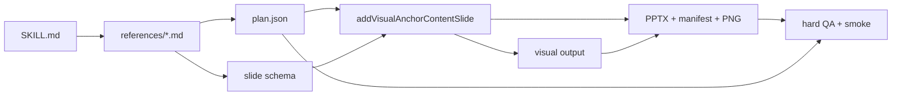
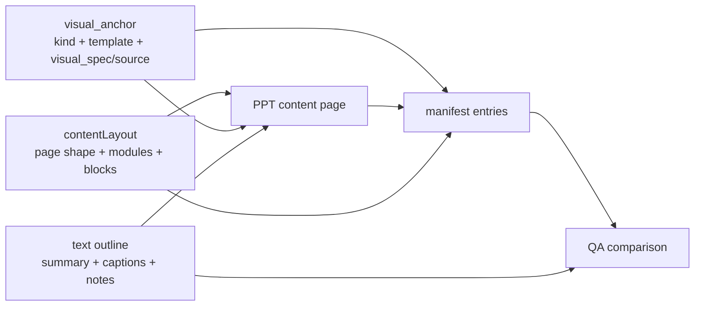
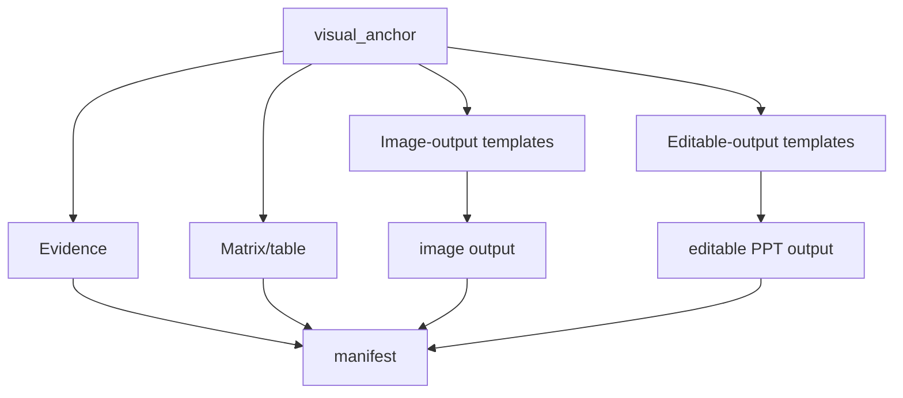

# Architecture Design

This is the development-time architecture document for the Huawei PPT generation repository. It explains the repository as a system first, then attaches constraints to the architecture elements that own them.

`SKILL.md` is runtime guidance for deck-generation agents. This document is for maintainers and coding agents changing this repository.

## Architectural Goal

The repository turns structured content plans into Huawei-style PPTX decks with deterministic AI execution.

Two invariants define the system:

1. Layout, visual rendering, and text outline are independent architecture elements.
2. Runtime instructions, generation scripts, and QA must stay consistent so agent output is predictable.

## Logical Architecture Elements

This view lists the architectural elements only. It intentionally does not draw relationships; relationships belong in the runtime flow view below.

```text
+----------------------------------------------------------------------------------+
| L1 Runtime Contract / 运行契约层                                                   |
|                                                                                  |
|        +--------------------------+        +-------------------------------+      |
|        | Deck-generation agent    |        | SKILL.md                      |      |
|        | runtime executor         |        | runtime workflow              |      |
|        +--------------------------+        +-------------------------------+      |
+----------------------------------------------------------------------------------+

+----------------------------------------------------------------------------------+
| L2 Schema Contract / Schema 契约层                                                 |
|                                                                                  |
|  +--------------------------+  +--------------------------+  +------------------+ |
|  | references/*.md          |  | *_plan.json              |  | Slide schema     | |
|  | semantic/style contracts |  | planned intent           |  | layout+visual+txt| |
|  +--------------------------+  +--------------------------+  +------------------+ |
+----------------------------------------------------------------------------------+

+----------------------------------------------------------------------------------+
| L3 Composition / 页面编排层                                                        |
|                                                                                  |
|  +--------------------------+  +--------------------------+  +------------------+ |
|  | addVisualAnchorContent   |  | hw_visual_anchor_slide   |  | PPT text layer   | |
|  | unified content API      |  | content layout composer  |  | editable notes   | |
|  +--------------------------+  +--------------------------+  +------------------+ |
+----------------------------------------------------------------------------------+

+----------------------------------------------------------------------------------+
| L4 Visual Rendering / 视觉渲染层                                                   |
|                                                                                  |
| +-------------------+ +-------------------+ +-------------------+ +-------------+ |
| | Template contract | | hw_diagram_helpers| | Matrix/table      | | Evidence    | |
| | fixed mapping     | | conceptual visual | | editable table    | | source image| |
| +-------------------+ +-------------------+ +-------------------+ +-------------+ |
+----------------------------------------------------------------------------------+

+----------------------------------------------------------------------------------+
| L5 Artifact / 产物层                                                               |
|                                                                                  |
|        +--------------------------+ +--------------------------+ +-------------+  |
|        | PPTX output              | | visual manifest          | | PNG evidence|  |
|        | generated deck           | | rendered anchor evidence | | COM render  |  |
|        +--------------------------+ +--------------------------+ +-------------+  |
+----------------------------------------------------------------------------------+

+----------------------------------------------------------------------------------+
| L6 Verification / 验证层                                                           |
|                                                                                  |
|        +--------------------------+        +-------------------------------+      |
|        | Hard QA                  |        | Development smoke tests       |      |
|        | check_huawei_pptx.js     |        | scripts/smoke/*.js           |      |
|        +--------------------------+        +-------------------------------+      |
+----------------------------------------------------------------------------------+
```

The system is intentionally layered:

- L1 tells the agent how to work at runtime.
- L2 defines the schemas and records planned intent.
- L3 composes Huawei pages and keeps layout, visual anchors, and text outline separate.
- L4 owns visual-anchor validation and implementation-owned output handling.
- L5 stores generated artifacts and render evidence.
- L6 verifies that the artifacts match the plan and contracts.

Dependencies flow downward during generation and back into L6 during verification. Lower layers must not invent semantics that belong to upper layers. Upper layers must not bypass lower-layer evidence and QA.

## Runtime Flow View

This view shows the main runtime relationship. It deliberately omits most internal elements so the logical element view remains readable.



## Architecture Elements

### Runtime Workflow

Owned by:

- `SKILL.md`

Responsibility:

- tell a deck-generation agent how to research, plan, generate, QA, export, and inspect a deck;
- define the runtime sequence an agent follows;
- avoid development-only explanations.

Constraints:

- `SKILL.md` should not be the primary home for architecture rationale.
- If runtime behavior changes, update `SKILL.md` only after the reference contract, implementation, QA, and smoke coverage are aligned.

### Reference Contracts

Owned by:

- `references/content_layout_schema.md`
- `references/visual_diagram_rules.md`
- `references/visual_diagram_spec_schema.md`
- `references/huawei_style_rules.md`
- `references/reference_images.md`
- `references/visual_diagram_test_cases.js`

Responsibility:

- define model-facing schemas and examples;
- explain semantic choices such as `visual_anchor.kind` and `template`;
- define field-level rules and reference layout choices.

Constraints:

- reference docs must describe schema, not implementation shortcuts;
- visual templates are semantic categories, not renderer-specific categories;
- new schema fields require matching implementation and QA support.

### Deck Plan

Owned by:

- `.tmp/<deck>/<deck>_plan.json`
- generation scripts that write the plan

Responsibility:

- record what the agent intended to render;
- record every content slide's visual anchors and relevant semantic reasons.

Constraints:

- output handling is implementation-owned and must not be recorded as plan configuration;
- plan must record all visual anchors on a slide, not only the first;
- plan and manifest must be comparable by `id`, `kind`, and `template`.

### Slide Schema

Owned by:

- deck-specific generation scripts;
- content layout data passed to `addVisualAnchorContentSlide`;
- `references/content_layout_schema.md`

Responsibility:

- combine layout selection, visual anchors, and text outline into a page-level data structure.

The slide schema has three independent substructures:

1. `contentLayout`: page shape and module/block placement.
2. `visual_anchor`: semantic visual relationship and visual data.
3. text fields: summary, captions, legends, source notes, interpretation, and conclusions.

Constraints:

- layout chooses where content goes;
- visual anchors choose what relationship is rendered;
- text fields explain the slide and remain editable PPT text;
- do not put captions, source notes, reading guidance, or conclusions under `visual_anchor.visual_spec`.

### Content Layout Composer

Owned by:

- `scripts/pptx/hw_visual_anchor_slide.js`

Responsibility:

- create Huawei content pages;
- apply fixed content layouts such as `two_column`, `biased_column`, `three_column`, and `four_column`;
- place module blocks;
- invoke visual rendering for `visual_anchor` blocks;
- write manifest entries for rendered visual anchors.

Constraints:

- `contentLayout` is a layout container, not a visual-template layer;
- allowed blocks are layout/text blocks and `visual_anchor` blocks;
- do not add layout-specific visual roles such as `image_text`, `metric_row`, `mini_card_grid`, or `sectioned_card_grid`;
- if a module needs multiple visuals and text fragments, represent them as multiple `visual_anchor` and `text` blocks;
- source images must enter through `Evidence`, not a direct image block.

### Visual Output

Owned by:

- `scripts/pptx/hw_diagram_helpers.js`

Responsibility:

- validate visual-anchor specs;
- route each semantic template through its fixed implementation;
- render conceptual anchors, evidence anchors, and table anchors through their fixed handling.

Constraints:

- implementation routing is not part of the model-facing visual spec;
- never accept slide-level, module-level, or anchor-level output overrides;
- generated visuals must contain only relationship-native content such as labels, axes, values, nodes, and edges;
- page-level prose remains outside `visual_spec`;
- generated image placement preserves aspect ratio and uses contain placement;
- do not silently substitute one template implementation for another to pass PowerPoint export.

### PPT Text Layer

Owned by:

- `scripts/pptx/hw_visual_anchor_slide.js`
- `scripts/pptx/hw_pptx_helpers.js`

Responsibility:

- render titles, section tabs, analysis summaries, captions, legends, source notes, interpretation text, and footers as editable PPT text.

Constraints:

- text that explains the visual belongs here, not inside `visual_spec`;
- visual captions and source notes must remain visible to QA;
- text layer may surround and explain visuals but must not become an untracked visual renderer.

### Manifest

Owned by:

- `writeVisualAnchorManifest`
- `pptx._hwVisualAnchorManifest`

Responsibility:

- record every rendered visual anchor;
- capture page, id, kind, template, renderer, render status, image dimensions, anchor area, image area, and layout metadata.

Constraints:

- every正文内容页 must have at least one manifest-backed rendered visual anchor;
- dense pages may have multiple manifest entries;
- manifest must be sufficient for QA to prove the implementation matched the plan.

### Hard QA

Owned by:

- `scripts/qa/check_huawei_pptx.js`

Responsibility:

- check PPTX style and structure;
- compare plan and manifest;
- validate visual-anchor schema and implementation contract;
- check exported render evidence when available.

Constraints:

- QA is part of the architecture;
- multi-anchor slides must validate every planned anchor;
- QA must fail implementation drift, missing anchors, unrendered anchors, invalid schema, and plan/manifest mismatch;
- QA must protect "at least one anchor" without regressing into "exactly one anchor";
- QA should distinguish accepted architecture exceptions from accidental bypass paths.

### Smoke Tests

Owned by:

- `scripts/smoke/*.js`
- `package.json` scripts

Responsibility:

- preserve architecture contracts during development;
- generate regression decks for visual-anchor templates;
- exercise PowerPoint COM export;
- verify helper export surfaces and QA rule coverage.

Constraints:

- when a schema or visual-anchor rule changes, smoke tests must change in the same commit;
- template output paths need coverage when visual-anchor behavior changes;
- PowerPoint COM failures should reveal implementation or environment problems, not trigger silent output substitution.

## Core Data Flow



The three inputs are independent:

- `contentLayout` must not carry visual semantics.
- `visual_anchor` must not carry page explanation prose.
- text outline must not bypass visual-anchor evidence.

## Visual Output Flow



Output constraints attach to this flow:

- `Evidence` is source-backed evidence handling.
- `Matrix/table` is a fixed table handling path and must still be represented as a visual anchor.
- all other anchors follow the fixed output path mapped from their semantic template.
- no slide, layout, or anchor can override output handling.

## Table Boundary

Tables are not a general page-level helper.

Architecture rule:

- if a table appears on a正文内容页 and carries evidence, comparison, judgment, or a structured claim, it must be represented as `visual_anchor.kind = "Matrix"` and `template = "table"`;
- the native table implementation is an internal rendering detail of that visual-anchor template;
- page schemas must not expose table drawing as a standalone layout helper.

This prevents native table drawing from becoming a bypass around plan, manifest, and QA.

## Image Boundary

Images are not a general page-level helper.

Architecture rule:

- source figures, screenshots, and charts must be `Evidence` anchors;
- generated diagram output may be inserted as an image only as the final artifact of a visual anchor;
- direct image roles such as `image_text` are not allowed in content layout.

This prevents image placement from bypassing semantic anchors and source tracking.

## Consistency Contract

The repository has three surfaces that must remain consistent:

1. runtime instructions in `SKILL.md`;
2. implementation in `scripts/pptx/*`;
3. enforcement in `scripts/qa/*` and `scripts/smoke/*`.

When changing behavior:

- update references so the schema is explicit;
- update generation helpers so the schema renders;
- update QA so bad output fails;
- update smoke tests so the contract stays protected;
- update `SKILL.md` only when the runtime workflow changes.

Do not merge changes where only the script works but the skill still asks for old behavior, or where the skill asks for behavior QA cannot verify.

## Recent Architecture Drift Patterns

These are concrete drift patterns this repository should avoid:

- layout shortcut becomes visual semantics: `image_text`, `metric_row`, or mini-grid roles in `contentLayout`;
- visual-anchor bypass: part of the visual is drawn through untracked helper calls;
- silent fallback: one template implementation quietly substitutes another to pass PowerPoint export;
- first-anchor-only QA: multi-anchor pages validate only the first manifest entry;
- unbounded helper exposure: low-level drawing helper becomes a schema-level escape hatch;
- runtime doc carries development principles while `AGENTS.md` and `doc/` stay silent.

## Known Enhancement

Issue [#2](https://github.com/MozhiJiawei/hw-ppt-gen/issues/2) tracks diagram density problems in small two-column and four-column anchors. This should be fixed inside the visual-anchor implementation through compact layouts, padding reduction, or target-size-aware template choices.

It must not be fixed by stretching generated images or bypassing visual anchors with untracked helper fragments.

## Change Checklist

Before merging architecture-sensitive changes, verify:

- the change fits the logical architecture above;
- layout, visual rendering, and text outline remain separate;
- new visual needs use existing `kind` / `template` semantics unless a new semantic template is truly required;
- source images use `Evidence`;
- tables on content pages use `Matrix/table` visual anchors;
- visual output handling remains implementation-owned;
- fixed template implementations do not silently substitute for each other;
- plan and manifest cover every visual anchor;
- QA checks the behavior being introduced;
- smoke tests cover affected visual-anchor templates when relevant;
- PowerPoint COM export remains part of the quality bar;
- `SKILL.md`, references, scripts, QA, and smoke tests agree.
