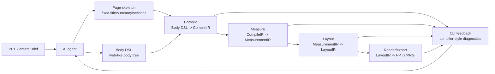

# Architecture Design

This is the development-time architecture contract for `hw-ppt-gen`.

`SKILL.md` is runtime guidance for deck-generation agents. This document is for maintainers and coding agents changing the repository.

## Core Idea

PPT generation should feel as smooth as web development.

An agent should not hand-place shapes and hope the deck looks right. It should write a stable page skeleton and a web-like Body DSL, then rely on a compiler-style runtime pipeline to produce a PPT:

```text
AI writes skeleton + Body DSL
        |
        v
DSL input
        |
        v
CompileIR
        |
        v
MeasurementIR
        |
        v
LayoutIR
        |
        v
PPTX + exported PNG
```

Each stage owns its own intermediate representation, its own checks, and its own diagnostics. When something fails, the CLI should behave like a compiler: report the failing phase, page, DSL selector/source span when available, code frame, reason, and repair hint directly in the command output.

The goal is not to make PPT generation clever through hidden fallbacks. The goal is to make the system legible enough that AI can write, receive feedback, repair, and rerun in a familiar loop.

## Non-Negotiable Invariants

1. **No manual layout escape hatch.** Body DSL authors describe structure and intent, not absolute coordinates, arbitrary styles, z-index, raw width/height percentages, or manual margins/padding.
2. **Every major stage has an IR.** Compile, measurement, and layout hand off explicit, inspectable objects. Internal implementation may change, but the stage boundary must stay real.
3. **Diagnostics belong to the stage that can understand the problem.** DSL checks validate whether the next stage can consume the input. Measurement checks validate measurable coverage and measurement consistency. Layout checks validate allocation, fit, spacing, alignment, overflow, and readability facts. Render/export checks validate the final artifact.
4. **Early stages preserve DSL traceability.** DSL, compile, measurement, and layout diagnostics should map back to the original Body DSL page/component when the source is known. Render/export diagnostics may be artifact-only.
5. **Runtime QA is part of generation.** A generated deck is not acceptable while any error-level runtime diagnostic remains. Visual review can add findings, but it cannot waive a runtime error.
6. **Smoke tests prove the framework, not the deck.** Runtime QA diagnoses generated decks at runtime. Smoke tests prove that the compiler pipeline, IR contracts, QA rules, CLI feedback, and rendering integrations behave correctly.

## Web Development Analogy

The intended mental model is deliberately close to the browser pipeline:

| Web development | PPT generation |
|---|---|
| HTML/JSX tree | Body DSL tree |
| CSS/layout constraints | layout family, spacing tokens, alignment/distribution constraints |
| DOM/component compile | CompileIR render model |
| intrinsic measurement | MeasurementIR primitive sizes and resize envelope |
| layout/reflow | LayoutIR containers, boxes, fit, overflow, alignment groups |
| browser paint/export | PPTX render and PowerPoint COM PNG export |
| browser/dev-server errors | compiler-style CLI diagnostics |

This analogy is architectural, not cosmetic. It means agents should work in a familiar loop:

```text
write DSL -> run generation -> read compiler-like CLI feedback -> fix DSL/content -> rerun
```

The repository should optimize for that loop.

## Runtime Pipeline



### AI Input

The agent writes two things:

- a page skeleton from the approved content brief;
- `bodyDsl` for the creative body area.

The skeleton owns fixed page fields: title, title note, section tabs, analysis summary, TOC/page sequence, footer source text, and other brief-controlled structure.

Body DSL owns the body region below the fixed page frame. It expresses layout family, modules, visual anchors, supporting components, and editable text.

### DSL Input Stage

Purpose:

- determine whether the page has usable Body DSL for the compiler;
- reject malformed DSL before measurement/layout work begins;
- preserve source locations for compiler-style feedback.

This stage should catch problems such as:

- missing body DSL where a content page requires one;
- DSL that cannot compile;
- missing real visual anchor where the page needs source-backed evidence;
- missing source/claim/evidence trace for visual evidence.

This stage should not become a broad style or content-quality checker. Text semantics, font choices, color choices, and final visual quality belong later unless they prevent the next stage from consuming the DSL.

### Compile Stage

Purpose:

- turn Body DSL into `CompileIR`;
- normalize the web-like DSL tree into renderable primitives;
- attach selectors, semantic stack, source component ids, and source spans.

Compile diagnostics should look like programming-language errors: unknown component, illegal prop, missing required field, invalid enum, invalid tree shape, or unsupported draw id.

Compile should not silently rewrite illegal DSL into a best-effort slide. If the DSL is not valid, it should fail loudly with actionable feedback.

### Measurement Stage

Purpose:

- turn `CompileIR` into `MeasurementIR`;
- prove every renderable primitive has a trustworthy size model;
- provide min/preferred/max useful size and resize policy facts for layout.

Measurement checks should validate:

- every compiled primitive that must participate in layout is measurable;
- measurement records correspond to DSL/CompileIR inputs;
- dimensions are positive and internally consistent;
- visual evidence has a bounded resize envelope.

Measurement owns sizing capability. It should not decide final page aesthetics. It gives layout enough information to make a good allocation.

### Layout Stage

Purpose:

- turn `MeasurementIR` into `LayoutIR`;
- allocate modules, columns, blocks, and visual slots;
- record constraints and facts needed for runtime layout QA.

LayoutIR should express:

- containers and records with final boxes;
- spacing token usage and observed gaps;
- alignment groups for top/bottom/center alignment;
- horizontal and vertical distribution constraints;
- fit/readability facts for text and evidence;
- overflow facts;
- fit policy, scale ratio, and aspect-ratio preservation;
- unused slot space or excessive internal gaps.

Layout diagnostics should catch issues such as:

- font size or color contract violations that need DSL traceability;
- text, visual, or module overflow;
- excessive block gaps inside a module;
- evidence below readable floor;
- visual evidence stretched or distorted beyond policy;
- layout fallback or unsupported primitive use.

This stage is where PPT starts to become visually disciplined: normalized whitespace, alignment, distribution, and readable evidence slots should be enforced here rather than left to final visual review.

### Render/Export Stage

Purpose:

- turn `LayoutIR` into PPTX and exported PNG evidence;
- prove the final PowerPoint artifact is usable.

Render/export checks are the artifact fallback. They may duplicate earlier concerns, and they do not need to map back to DSL.

They should catch final output failures such as:

- PPTX cannot be opened/exported by PowerPoint COM;
- exported slide count mismatch;
- broken image or missing rendered visual;
- artifact-only clipping/overflow that escaped earlier stages;
- mismatch between planned visuals and rendered visuals.

## Intermediate Representations

IRs are implementation objects first, not a mandate to store everything as JSON. They may be serialized to JSON for smoke tests, debugging, and reports, but the architecture requirement is the boundary and shape, not the file format.

### CompileIR

CompileIR records what the DSL means after parsing and normalization:

- page id/index;
- layout family;
- module tree;
- renderable primitives;
- selector/source span/code frame;
- semantic stack;
- source component identity;
- source/evidence trace where relevant.

### MeasurementIR

MeasurementIR records what each primitive can occupy:

- primitive id and source selector;
- taxonomy kind/template;
- min size;
- preferred size;
- max useful size;
- resize policy;
- aspect-ratio policy;
- measurement source;
- measurement diagnostics.

### LayoutIR

LayoutIR records how measured primitives are actually allocated:

- page and container boxes;
- module/column/block records;
- final boxes;
- spacing and distribution constraints;
- alignment groups;
- fit/readability/overflow facts;
- fit policy and scale ratio;
- source mapping back to DSL/CompileIR/MeasurementIR.

## Body DSL

Body DSL is the AI-facing creative body authoring surface.

It should feel like writing a constrained component tree, not hand-editing PowerPoint XML. It gives the agent a familiar way to describe:

- layout family, such as `two_column`, `biased_column`, `three_column`;
- modules;
- real visual anchors;
- supporting readouts;
- text blocks and emphasis;
- source binding.

Body DSL must reject:

- arbitrary style objects;
- absolute x/y coordinates;
- manual width/height percentages;
- manual margins/padding;
- z-index or layer-order hacks;
- component-specific shape overrides that bypass measurement/layout.

If a capability is not supported, it should be absent from the DSL contract or fail at compile time. Runtime QA should diagnose AI uncertainty in generated decks, not compensate for unsupported code paths.

## Visual Anchors And Supporting Components

Content slides need real visual anchors. A table, KPI card row, or text block alone cannot pretend to be evidence.

Real visual anchors have an explicit proof hierarchy:

| Proof tier | DSL component | Meaning |
|---|---|---|
| `source_evidence` | `<EvidenceFigure>`, `<EvidenceChart>` | Original source figure/chart/image that proves the claim. This is the highest-priority proof object. |
| `generated_drawing` | `<Visual draw="Kind/template" ... />` | Hand-drawn/generated explanation from an official renderer. It can clarify mechanisms and relationships, but it is secondary to source evidence. |
| `supporting_readout` | `<KpiCards>`, `<Table>`, `<CapabilityStack>` | Compact readout that supports an already-proven claim. It does not satisfy source evidence by itself. |
| `text` | `<InsightText>` | Editable explanation and conclusion. It never replaces visual proof. |

When the authored Body DSL first chooses source evidence for a page or module, later QA repair should preserve that same source evidence identity. After a successful DSL compile, the runtime records the primary visual-anchor proof type for each page/module and the CLI echoes that memory so the next repair loop knows the anchor is locked. Layout fixes should give the evidence more effective slot, reduce neighboring prose/supporting readouts, rebalance columns, or add source-grounded content around it. A generated drawing may annotate or explain the same evidence chain, but it must not downgrade the original source evidence merely because drawing is easier to lay out.

When layout diagnostics report sparse content or excessive internal gaps, feedback should stay objective and positive: state the measured gap/density problem and ask the author to review the source material for the module claim, then add source-grounded visual or text content that supports the same viewpoint. The feedback should not teach authors to write repair notes into the slide body.

Supporting components include KPI cards, tables, capability stacks, structured bullets, and compact readouts. They can clarify evidence, but they do not replace it.

Every visual anchor should carry source/claim/evidence traceability when the page claim depends on source material.

## Runtime Feedback Contract

Runtime feedback is a cross-stage data contract.

An issue should include:

- `phase`: DSL input, compile, measurement, layout, or render/export;
- `severity`: error/warning/info;
- `code`: stable machine-readable rule code;
- `message`: short user-facing explanation;
- `target`: page/selector/component/artifact location;
- `source`: source span/code frame when available;
- `semanticStack`: human-readable component context when available;
- `repairHint`: actionable next step.

The CLI should surface error-level feedback directly. An agent should not need to search logs, inspect hidden reports, or read a JavaScript stack trace before it can repair the DSL.

Reporters format feedback. Producers own detection. A reporter must not become a second rule engine.

## Forward Tests

Forward tests are end-to-end skill validation, not smoke tests.

They ask a clean candidate agent to generate a deck from realistic inputs and then judge the exported PPT visually. Candidate agents should not see judge rubrics, expected outputs, prior failures, or hidden examples.

Forward tests should not require the candidate to hand over runtime QA reports or visual-review notes as special test artifacts. Runtime QA is part of generation/export. The forward judge inspects the exported PNGs and judges whether the deck is good.

## Smoke Tests

Smoke tests protect the architecture while maintainers refactor.

The smoke report is organized by the runtime pipeline:

```text
01 AI 输入契约
02 DSL 编译
03 测量
04 排版
05 导出渲染
06 运行态 QA 与 CLI 反馈
```

Smoke tests should prove:

- AI-facing contracts are discoverable and synchronized;
- DSL compile errors are deterministic and source-mapped;
- every DSL primitive has compile, render, and measurement evidence;
- measurement can produce trustworthy bounds;
- layout can express and check spacing, alignment, distribution, fit, overflow, and readability;
- PPTX artifacts can be opened and exported through PowerPoint COM;
- every runtime QA rule has deterministic positive/negative coverage;
- CLI error output is directly actionable for agents.

Smoke tests are allowed to serialize IRs and produce review decks. Those are development artifacts, not runtime requirements for forward-test candidates.

## Repository Ownership Map

| Area | Primary files |
|---|---|
| Runtime instructions | `SKILL.md` |
| Authoring contracts | `references/*.md` |
| Body DSL registry/discovery/compiler | `scripts/pptx/dsl/*` |
| Runtime QA framework | `scripts/pptx/qa/*` |
| Measurement/layout primitives | `scripts/pptx/layout/*` |
| PPT composition/rendering | `scripts/pptx/*.js` |
| PowerPoint COM integration | `scripts/pptx/powerpoint_com_broker.*`, `scripts/pptx/export_pptx_images.js`, `scripts/pptx/measure_pptx_layout.js` |
| Development smoke tests | `scripts/smoke/*` |
| Software test report | `scripts/quality/software_test_report.js` |
| Forward tests | `forward-tests/huawei-ppt-gen/*` |

## Change Rules

When changing the architecture:

1. Update the owning implementation.
2. Update the relevant runtime/reference contract.
3. Update or add smoke coverage for the affected stage and QA rule.
4. Keep CLI feedback actionable.
5. Keep `SKILL.md` aligned with what the implementation really supports.
6. Do not add compatibility shims that keep retired architecture paths alive.

When deleting an old path, delete its tests, docs, references, and report entries together. Leaving retired architecture visible to agents creates bad training signals and future regressions.
