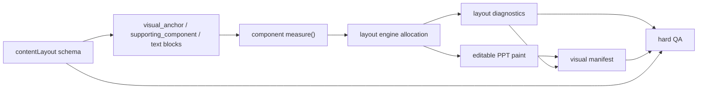

# CSS-like Editable PPT Layout Engine Refactor Plan

## Overview

This plan replaces the current case-by-case content-layout sizing path with a CSS-like, editable-PPT layout engine subset. The target is not browser rendering and not screenshot output. The target is a deterministic pipeline:

```text
contentLayout + blocks
-> component measure contracts
-> Flex/Grid-like allocation
-> absolute PPT boxes
-> pptxgenjs text/shapes/images/tables
-> manifest + layout diagnostics + QA
```

The refactor should intentionally discard and rewrite the current layout scripts and hard-QA implementation where they encode local sizing patches, while preserving the existing behavioral assets: diagram rendering capability, visual-anchor schema validation, smoke fixtures, PowerPoint COM export coverage, and forward-test cases such as TiDAR evidence readability.

---

## Problem Frame

Issue #20 identifies a structural problem: `scripts/pptx/hw_visual_anchor_slide.js` currently uses local rules in `splitBlockAreas()`, `adjustedBlockSize()`, `minimumVerticalBlockSize()`, and component-specific estimators to negotiate space. `scripts/qa/check_huawei_pptx.js` then catches many failures after rendering, such as evidence too small, text frame mismatch, visual frame gaps, and module misalignment.

That has worked as incremental hardening, but it makes the architecture drift toward a pile of component exceptions. The refactor should make layout a first-class layer with explicit measure, allocation, diagnostics, and paint boundaries while preserving the architecture contract from `docs/architecture_design.md`: layout, visual rendering, and text outline remain independent.

---

## Requirements Trace

- R1. Components expose intrinsic sizing: `minSize`, `preferredSize`, `maxUsefulSize`, and `overflowPolicy` for at least `Evidence/source_figure`, `Quantity/data_cards`, `Matrix/table`, and text blocks.
- R2. Layout allocation happens before paint through a Flex-like subset, initially covering the module internals that replace `splitBlockAreas()`.
- R3. The first prototype must preserve editable PPT output: text boxes, rectangles/cards, native tables where applicable, images, lines, and arrows.
- R4. Layout diagnostics must be emitted before or alongside manifest entries: per block min/preferred/final size, shrink decisions, fallback decisions, and infeasible combinations.
- R5. Existing visual-anchor manifest traceability must remain intact: every rendered visual anchor and supporting component still records `id`, `kind`, `template`, renderer, rendered state, visual slot, visual/image area, and content-layout context.
- R6. TiDAR Page 6-style density conflicts must be handled without local `data_cards` or evidence-height special cases: source evidence + KPI cards + text should allocate readable boxes or fail with actionable diagnostics.
- R7. Existing runtime contracts stay aligned: `references/*`, `SKILL.md`, implementation, QA, and smoke tests must describe and enforce the same behavior.
- R8. Reuse existing test capability rather than preserving test implementation shape: keep forward tests, diagram fixtures, source-image fixtures, and PowerPoint export checks as regression assets while allowing the smoke harness and QA internals to be rewritten.

---

## Scope Boundaries

- Do not implement full CSS, browser layout, or CSS parsing.
- Do not default to HTML screenshot-to-PPT image output.
- Do not migrate every existing visual component in the first pass.
- Do not expose low-level coordinates, direct image blocks, or table helper shortcuts through runtime schemas.
- Do not let supporting components satisfy the real visual-anchor requirement.

### Deferred to Follow-Up Work

- Full `two_column` / `biased_column` / `three_column` / `four_column` family scoring can follow after the module-internal engine proves stable.
- Browser preflight can remain a research branch if Yoga or a self-hosted Flex subset cannot provide enough diagnostics.
- AI-generated fallback image policy is out of scope except where forward tests ensure it is not used to hide evidence readability failures.

---

## Context & Research

### Relevant Code and Patterns

- `scripts/pptx/hw_visual_anchor_slide.js`: current composition path, especially block normalization, `splitBlockAreas()`, `addContentPanelModule()`, and manifest schema emission.
- `scripts/pptx/hw_diagram_helpers.js`: reusable visual rendering and validation surface; should be kept as the paint/render backend rather than rewritten first.
- `scripts/qa/check_huawei_pptx.js`: hard-QA rules to mine for layout diagnostics, then rewrite around pre-paint diagnostics plus manifest validation.
- `scripts/smoke/fixtures/visual_diagram_test_cases.js`: diagram rendering capability to preserve.
- `forward-tests/huawei-ppt-gen/tidar-evidence-readability`: key behavioral regression for evidence readability and density conflict handling.
- `forward-tests/huawei-ppt-gen/aegaeon-content-aware-layout`: key behavioral regression for content-aware Huawei layouts.

### Institutional Learnings

- `docs/architecture_design.md` requires separation between layout, visual rendering, text outline, manifest, and QA.
- `docs/brainstorms/aegaeon-summary-layout/requirements.md` defines the product/design intent behind content-aware layout: preserve Huawei visual language while adapting geometry to evidence weight, text budget, and density.

### External References

- `yoga-layout` is a current MIT-licensed npm package at version `3.2.1`, described as an embeddable Flexbox layout engine.
- `css-layout` exists as an older BSD-licensed JavaScript CSS layout reimplementation at version `1.1.1`, useful mainly as a cautionary comparison.
- `happy-dom` is current at version `20.9.0`, but browser-like DOM preflight should be treated as higher complexity than a first-pass Flex subset.

---

## Key Technical Decisions

- Use a new layout engine boundary instead of extending `splitBlockAreas()`: the current function is the failure point and should become an adapter target or be removed.
- Prototype with a self-owned Flex-like subset first, while keeping Yoga behind an evaluation adapter: this avoids making package behavior the architecture contract before diagnostics, inch units, and PPT-specific overflow policies are understood.
- Keep `hw_diagram_helpers.js` as the renderer backend initially: the refactor is about measure/layout/diagnostics, not replacing chart and diagram drawing.
- Rewrite QA around contracts, not rendered symptoms: rendered PNG checks and geometry checks still matter, but the primary enforcement should compare plan, layout diagnostics, manifest, and final PPT geometry.
- Treat current smoke and forward tests as behavior assets, not implementation assets: fixtures and rubrics survive; brittle assertions tied to old special cases can be replaced.

---

## Alternative Approaches Considered

| Approach | Use | Decision |
|---|---|---|
| Yoga-first engine | Use `yoga-layout` for all Flex allocation | Evaluate through an adapter, but do not make it the first architecture dependency until measure and diagnostics needs are proven. |
| Self-owned Flex subset | Implement only row/column/gap/flex/min/max/preferred/overflow policies needed by this repo | Preferred first implementation because it is small, deterministic, and can emit exactly the diagnostics QA needs. |
| Browser preflight | Use HTML/CSS to measure layout, then map boxes to PPT | Keep as fallback research; mapping DOM/CSS behavior back to editable PPT and manifest semantics is likely higher complexity. |
| Keep patching current scripts | Add more min-height and estimator rules | Rejected; issue #20 is specifically about escaping this case-by-case trajectory. |

---

## High-Level Technical Design

> This illustrates the intended approach and is directional guidance for review, not implementation specification.



The core new boundary is a measured layout tree. Each node should have a semantic role, style subset, measure result, final box, and diagnostics. Paint functions receive final boxes; they do not allocate space.

---

## Output Structure

```text
scripts/pptx/layout/
  engine.js
  measure_components.js
  diagnostics.js
  style_schema.js
  adapters.js
scripts/smoke/layout/
  fixtures/
  test_layout_engine.js
  test_layout_diagnostics.js
```

The exact file split may change during implementation, but layout engine code should not remain embedded in `hw_visual_anchor_slide.js`.

---

## Implementation Units

- U1. **Define Layout Contract and Reference Docs**

**Goal:** Add a development/runtime contract for CSS-like layout subset, component measurement, overflow policies, and diagnostics.

**Requirements:** R1, R2, R4, R7

**Dependencies:** None

**Files:**
- Create: `references/layout_engine_schema.md`
- Modify: `docs/architecture_design.md`
- Modify: `references/content_layout_schema.md`
- Modify: `references/layout_standards.md`

**Approach:**
- Define supported style properties: `display`, `direction`, `gap`, `flex`, `basis`, `min`, `max`, `preferred`, `align`, and explicit overflow policies.
- Define supported node roles without creating new visual semantics: layout containers, `visual_anchor`, `supporting_component`, and `text`.
- Define diagnostics as part of the architecture contract, not a debug artifact.

**Execution note:** Contract-first; implementation should not add fields that docs and QA cannot explain.

**Patterns to follow:**
- `references/content_layout_schema.md`
- `docs/architecture_design.md`

**Test scenarios:**
- Integration: A documented `visual_anchor + supporting_component + text` tree maps to existing semantic block roles without direct coordinates.
- Error path: A schema that tries to use direct image/table blocks remains invalid under the new contract.
- Edge case: Supporting components remain measurable and manifest-backed but still do not count as strict visual anchors.

**Verification:**
- Reviewers can tell which layer owns layout allocation, rendering, diagnostics, and QA.

---

- U2. **Build Component Measurement Layer**

**Goal:** Extract intrinsic sizing for evidence, data cards, tables, and text into reusable measure functions.

**Requirements:** R1, R6

**Dependencies:** U1

**Files:**
- Create: `scripts/pptx/layout/measure_components.js`
- Create: `scripts/smoke/layout/test_component_measurement.js`
- Modify: `scripts/pptx/hw_visual_anchor_slide.js`
- Modify: `scripts/pptx/hw_diagram_helpers.js`

**Approach:**
- Move useful estimators out of `hw_visual_anchor_slide.js` into component-specific measure functions.
- Preserve existing knowledge such as text-height estimation, source image aspect ratio, data-card readable dimensions, and table row capacity.
- Return structured measure results instead of raw heights.

**Execution note:** Characterization-first; preserve current estimator behavior with focused tests before changing allocation.

**Patterns to follow:**
- `estimateTextBlockSize()` and `estimateTextBlockWrappedLines()` in `scripts/pptx/hw_visual_anchor_slide.js`
- `estimateTextBoxHeight()` in `scripts/pptx/hw_pptx_helpers.js`
- data-card validation/rendering in `scripts/pptx/hw_diagram_helpers.js`

**Test scenarios:**
- Happy path: A normal evidence source image reports a readable minimum, preferred size derived from aspect ratio, and max useful size capped by container intent.
- Happy path: Three KPI cards report a minimum height that keeps value/unit/label readable.
- Edge case: Long KPI values reduce value font size in measurement consistently with rendering expectations.
- Edge case: Dense table rows report infeasible or overflow-prone measurement rather than silently shrinking.
- Error path: Missing evidence file returns a diagnostic-friendly measurement state that downstream QA can report.

**Verification:**
- The measure layer can be tested without creating a PPTX.

---

- U3. **Implement Flex-like Layout Engine Subset**

**Goal:** Introduce a deterministic layout engine that allocates final PPT boxes from measured nodes.

**Requirements:** R2, R4, R6

**Dependencies:** U2

**Files:**
- Create: `scripts/pptx/layout/engine.js`
- Create: `scripts/pptx/layout/diagnostics.js`
- Create: `scripts/pptx/layout/style_schema.js`
- Create: `scripts/smoke/layout/test_layout_engine.js`
- Create: `scripts/smoke/layout/test_layout_diagnostics.js`

**Approach:**
- Support only the subset needed by module internals: vertical and horizontal flow, gap, fixed basis, flex grow/shrink, min/preferred/max useful sizes, and overflow policies.
- Emit diagnostics for shrink, clamp, overflow, and infeasible layout.
- Keep all units in PPT inches to match existing renderer geometry.

**Patterns to follow:**
- Current `splitVerticalBlockAreas()` behavior only as a regression comparison, not as the design model.
- QA issue detail style in `scripts/qa/check_huawei_pptx.js`.

**Test scenarios:**
- Happy path: Evidence gets flexible remaining space after data cards and text reserve intrinsic size.
- Happy path: A two-block horizontal tree allocates tall evidence plus side text when policy allows side-by-side flow.
- Edge case: Flexible evidence cannot shrink below readable minimum while text/data cards preserve minimum sizes.
- Error path: Total minimum sizes exceed container size and produce an infeasible diagnostic naming each claimant.
- Integration: Final boxes are stable and deterministic for identical input trees.

**Verification:**
- Layout can be validated through JSON diagnostics without rendering PowerPoint.

---

- U4. **Adapt Content Composer to Measure/Layout/Paint**

**Goal:** Replace `splitBlockAreas()`-style allocation in content modules with the new layout engine while keeping PPT output editable.

**Requirements:** R2, R3, R5, R6

**Dependencies:** U3

**Files:**
- Modify: `scripts/pptx/hw_visual_anchor_slide.js`
- Create: `scripts/pptx/layout/adapters.js`
- Modify: `scripts/smoke/test_visual_anchor_content_contract.js`

**Approach:**
- Convert existing `contentLayout.modules[].blocks[]` into measured layout nodes.
- Pass final boxes to existing paint functions: `renderVisualAnchorBlock()`, text rendering, and supporting-component rendering.
- Record layout diagnostics in each manifest-backed slide entry and in slide-level content layout schema.
- Keep current module frame and Huawei style drawing in the composer.

**Execution note:** Adapter-first; existing runtime schema should still work during the migration.

**Patterns to follow:**
- `addContentPanelModule()` and `describeBlockLayout()` in `scripts/pptx/hw_visual_anchor_slide.js`
- `writeVisualAnchorManifest()` manifest emission pattern

**Test scenarios:**
- Happy path: Existing content-layout smoke deck renders editable PPT objects with manifest entries for every anchor/supporting component.
- Happy path: Existing generated diagrams still render through `hw_diagram_helpers.js`.
- Integration: Manifest entries include layout diagnostics and final boxes matching PPT geometry.
- Edge case: A module with only supporting components still fails strict anchor requirements.
- Error path: Infeasible layout prevents silent unreadable output and produces actionable diagnostics.

**Verification:**
- The content-layout smoke fixture renders through the new engine without relying on old block-specific special cases.

---

- U5. **Rewrite QA Around Plan, Diagnostics, Manifest, and Render Evidence**

**Goal:** Replace symptom-heavy hard-QA internals with contract checks over layout diagnostics, manifest traceability, and exported render evidence.

**Requirements:** R4, R5, R6, R7

**Dependencies:** U4

**Files:**
- Modify: `scripts/qa/check_huawei_pptx.js`
- Create: `scripts/smoke/layout/test_layout_qa_contract.js`

**Approach:**
- Preserve critical existing rules: manifest required, plan/manifest alignment, strict visual-anchor requirement, supporting components not counted as anchors, evidence images present, aspect ratio preserved, brief fidelity.
- Move sizing assertions toward layout diagnostics: infeasible minimums, shrink below readable floor, text overflow estimate mismatch, and visual frame gap should be diagnosed at layout stage when possible.
- Keep exported PNG/COM evidence checks as the final safety net.

**Execution note:** Rewrite allowed, but rule intent must survive through fixtures.

**Patterns to follow:**
- Existing issue detail objects in `scripts/qa/check_huawei_pptx.js`

**Test scenarios:**
- Happy path: A valid evidence + data cards + text module passes layout diagnostics and manifest QA.
- Error path: A layout with total minimum height above container fails before or during QA with an infeasible-layout issue.
- Error path: A supporting-component-only module fails strict visual-anchor QA.
- Error path: A rendered evidence placeholder fails source-image presence QA.
- Integration: Plan and manifest mismatch still fails even when layout diagnostics are clean.

**Verification:**
- QA can explain whether a page was feasible, what was shrunk, and why a fallback occurred.

---

- U6. **Preserve and Rebase Smoke / Forward Test Capability**

**Goal:** Convert existing test assets into regression coverage for the new engine.

**Requirements:** R6, R8

**Dependencies:** U4, U5

**Files:**
- Modify: `scripts/smoke/test_diagram_helpers.js`
- Modify: `scripts/smoke/test_powerpoint_com_export.js`
- Modify: `package.json`
- Modify: `forward-tests/huawei-ppt-gen/tidar-evidence-readability/judge/rubric.md`
- Modify: `forward-tests/huawei-ppt-gen/aegaeon-content-aware-layout/judge/rubric.md`

**Approach:**
- Keep diagram test cases and rendering smoke tests as renderer capability checks.
- Add a TiDAR-style fixture to smoke coverage: source evidence + `Quantity/data_cards` + text in a constrained module.
- Use forward tests as end-to-end behavior checks, not as internal implementation locks.
- Preserve PowerPoint COM export as part of the quality bar.

**Patterns to follow:**
- `forward-tests/huawei-ppt-gen/tidar-evidence-readability`
- `forward-tests/huawei-ppt-gen/aegaeon-content-aware-layout`
- `scripts/smoke/test_powerpoint_com_export.js`

**Test scenarios:**
- Integration: TiDAR-style module keeps evidence above readable height, KPI cards above readable minimum, and text within measured frame.
- Integration: Aegaeon content-aware layout still preserves Huawei visual language while allowing content-aware geometry.
- Happy path: Diagram helper smoke still covers major generated visual templates.
- Error path: COM export failures remain visible and are not hidden by fallback rendering.

**Verification:**
- The full smoke suite protects both the new layout engine and the old visual rendering capabilities that remain valuable.

---

- U7. **Update Runtime Skill Instructions After Behavior Stabilizes**

**Goal:** Align runtime agent guidance with the new layout contract only after implementation, QA, and smoke coverage agree.

**Requirements:** R7

**Dependencies:** U1, U4, U5, U6

**Files:**
- Modify: `SKILL.md`
- Modify: `README.md`

**Approach:**
- Update runtime guidance to describe CSS-like layout semantics at the schema level.
- Keep development rationale in `docs/architecture_design.md` and `references/layout_engine_schema.md`, not in `SKILL.md`.
- Explain diagnostics expected from generation runs without asking runtime agents to hand-tune coordinates.

**Patterns to follow:**
- Runtime/development boundary described in `AGENTS.md`
- Consistency contract in `docs/architecture_design.md`

**Test scenarios:**
- Integration: Runtime docs, reference docs, implementation, QA, and smoke tests use the same terms for measure/layout/paint/diagnostics.
- Error path: Runtime docs do not instruct agents to use direct coordinates, direct image blocks, direct table blocks, or screenshot fallback.

**Verification:**
- A deck-generation agent can follow `SKILL.md` without learning development-only internals.

---

## Phased Delivery

### Phase 1: Research Prototype With Compatibility Adapter

- Land U1-U3 and a minimal adapter that can lay out one module shape.
- Target the issue #20 prototype: evidence + data cards + text.
- Keep old composer available behind compatibility only until parity fixtures exist.

### Phase 2: Composer and QA Rewrite

- Land U4-U5.
- Replace `splitBlockAreas()` for content-panel modules.
- Rebase QA to read layout diagnostics and manifest geometry together.

### Phase 3: Regression Assets and Runtime Alignment

- Land U6-U7.
- Turn TiDAR and Aegaeon forward tests into explicit acceptance gates.
- Update runtime guidance after behavior is proven.

---

## System-Wide Impact

- **Interaction graph:** `contentLayout` schema feeds a layout tree; layout tree calls component measurement; final boxes feed existing PPT paint/render functions; diagnostics and paint results feed manifest; QA compares plan, diagnostics, manifest, PPTX geometry, and optional PNG evidence.
- **Error propagation:** infeasible layout should produce structured diagnostics and blocking QA issues, not silent shrinkage.
- **State lifecycle risks:** `.tmp` artifacts must include diagnostics in a predictable location or manifest field so smoke and forward tests can inspect them.
- **API surface parity:** existing content-layout JSON remains the primary runtime surface; CSS-like style subset should be additive or adapted, not a new untracked bypass.
- **Integration coverage:** unit tests for measurement and engine are insufficient; content-layout smoke, QA regressions, diagram smoke, sample deck, and PowerPoint COM export are still required.
- **Unchanged invariants:** visual anchors remain semantic contracts; supporting components remain supporting components; output handling remains implementation-owned; PowerPoint output remains editable by default.

---

## Risks & Dependencies

| Risk | Likelihood | Impact | Mitigation |
|---|---:|---:|---|
| Rewriting QA loses existing hard-earned guardrails | Medium | High | Preserve current QA rule intent as fixture scenarios before replacing internals. |
| Layout engine becomes a second renderer | Medium | High | Keep engine limited to measurement/allocation/diagnostics; paint remains in PPT helpers and visual renderers. |
| Yoga adapter hides decisions inside dependency behavior | Medium | Medium | Prototype self-owned subset first; compare Yoga as an optional backend only after diagnostics are clear. |
| Existing smoke tests encode old implementation quirks | High | Medium | Classify each smoke as behavior asset, renderer asset, or obsolete implementation assertion before migration. |
| Runtime schema grows coordinates or layout-specific visual roles | Medium | High | Enforce through reference docs and QA that schema roles stay `visual_anchor`, `supporting_component`, and `text`. |
| Forward tests are expensive to run every iteration | Medium | Medium | Use focused smoke fixtures for iteration and forward tests as broader acceptance gates. |

---

## Success Metrics

- A constrained evidence + KPI cards + text module lays out without `data_cards`-specific local height patches in the composer.
- Layout diagnostics identify infeasible combinations before final visual QA.
- Existing diagram helper capabilities still pass smoke tests.
- TiDAR evidence readability forward test no longer depends on shrinking source figures or hiding density failures.
- Hard QA failures become more actionable: they name the measured claimant, final size, policy, and violated threshold.

---

## Documentation / Operational Notes

- `references/layout_engine_schema.md` should become the durable contract for the new layer.
- `docs/architecture_design.md` should describe the new L3 layout-engine sublayer without moving runtime guidance into architecture prose.
- `SKILL.md` should be updated last, after implementation and QA stabilize.
- Any dependency choice such as `yoga-layout` must be recorded as an implementation detail unless the repo intentionally commits to it as the layout contract.

---

## Sources & References

- Origin document: `docs/brainstorms/aegaeon-summary-layout/requirements.md`
- Related issue: `https://github.com/MozhiJiawei/hw-ppt-gen/issues/20`
- Architecture contract: `docs/architecture_design.md`
- Content layout schema: `references/content_layout_schema.md`
- Current composer: `scripts/pptx/hw_visual_anchor_slide.js`
- Current visual renderer: `scripts/pptx/hw_diagram_helpers.js`
- Current hard QA: `scripts/qa/check_huawei_pptx.js`
- Diagram fixtures: `scripts/smoke/fixtures/visual_diagram_test_cases.js`
- TiDAR forward test: `forward-tests/huawei-ppt-gen/tidar-evidence-readability`
- Aegaeon forward test: `forward-tests/huawei-ppt-gen/aegaeon-content-aware-layout`
