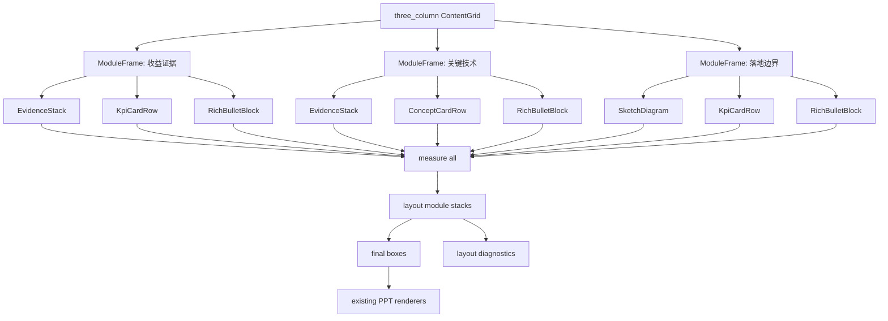
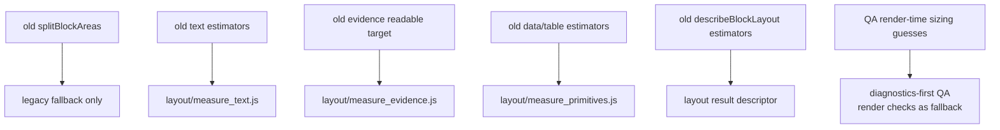

# refactor: Add Measure-Driven Huawei Layout Primitives

## Overview

Introduce a measure-driven layout layer into the existing Huawei PPT generation path by first defining a complete semantic taxonomy for the body content area below the analysis summary, then implementing measurement and layout for the highest-impact primitives.

This is **not** a clean-room rewrite and not an HTML/CSS renderer migration. The current main path can already produce strong Huawei-style PPT pages. The change should preserve that renderer and visual language while adding the missing pre-render layout contract:

```text
contentLayout modules/blocks
-> Huawei primitive tree
-> primitive measure contracts
-> constrained layout allocation
-> existing editable PPT renderers
-> layout diagnostics + manifest + QA
```

The goal is to stop discovering unreadable evidence, collapsed KPI cards, and text-frame mismatch only after rendering. Components should report their semantic family, anchor eligibility, measurement support level, minimum/preferred/maximum useful size, and resize policy before paint; a layout manager should allocate final boxes or fail with actionable diagnostics.

---

## Problem Frame

The current code has accumulated real layout knowledge, but much of it is embedded inside local sizing rules in `scripts/pptx/hw_visual_anchor_slide.js`, especially `splitBlockAreas()`, `splitVerticalBlockAreas()`, `fitVerticalBlockSizes()`, `minimumVerticalBlockSize()`, `adjustedBlockSize()`, and component-specific estimators.

The resulting pages can look good, as shown by the current TiDAR main-path output shared in this planning discussion: a stable Huawei page with title/tabs/source footer, an analysis-summary band, three content modules, source evidence, KPI cards, compact bullets, and a hand-drawn landing-boundary diagram. That success should become the architecture source of truth.

The missing architecture layer is not a new renderer. It is a "layout manager" that can ask each primitive:

- What is your minimum readable size?
- What is your preferred size?
- What is your maximum useful size?
- How may you shrink or grow?
- When should the page fail rather than render unreadable content?

Then the layout manager can allocate boxes, record what was compressed, and give QA a structured explanation instead of relying on post-render symptoms alone.

---

## Requirements Trace

- R1. Preserve the existing editable PPT renderer and Huawei visual language in `scripts/pptx/hw_visual_anchor_slide.js` and `scripts/pptx/hw_diagram_helpers.js`.
- R2. Define a complete taxonomy for all body-content components that can appear below the analysis summary, including evidence, quantitative readouts, structured text, relationship diagrams, matrices/tables, media/decorative elements, and layout containers.
- R3. Map every existing `visual_anchor.kind/template`, `supporting_component.kind/template`, and text block into that taxonomy with explicit support status: `measured`, `estimated`, `legacy_fallback`, or `unsupported`.
- R4. Introduce explicit measure contracts for the highest-impact primitives already present in successful main-path pages: `EvidenceStack`, `KpiRow`, `ConceptCardRow`, `RichBulletBlock`, `SketchDiagram`, and `MatrixTable`.
- R5. Replace module-internal block allocation with a measure-first layout path that outputs final boxes plus diagnostics before render for supported component combinations.
- R6. Keep layout decisions constrained to existing fixed layout families: `two_column`, `biased_column`, `three_column`, and `four_column`; do not silently invent or switch layout families.
- R7. Emit diagnostics for taxonomy classification, support status, min/preferred/final size, shrink amount, readability floor, fallback decisions, and infeasible combinations.
- R8. Keep visual-anchor manifest traceability intact: every rendered visual anchor and supporting component remains comparable by `id`, `kind`, and `template`.
- R9. Make QA consume layout diagnostics where available while preserving current hard guards for plan/manifest parity, anchor requirements, evidence size, text frame mismatch, brief fidelity, and PowerPoint render evidence.
- R10. Use the TiDAR-style three-column main-path page as the first golden sample shape: evidence + KPI row + bullets, evidence + cards + bullets, sketch diagram + KPI row + bullets.
- R11. Keep this as an incremental migration; old `splitBlockAreas()` behavior may remain as compatibility fallback until smoke and forward-test coverage prove the new path.
- R12. Update runtime references and `SKILL.md` only after implementation, QA, and smoke coverage agree on the new contract.

---

## Scope Boundaries

- Do not create a separate demo skill or clean-room generator.
- Do not replace the current PPT renderer with HTML screenshots, browser preflight, or SVG-first output.
- Do not introduce a general CSS parser or full browser layout model.
- Do not let components return page coordinates. Components report size needs and resize policy; layout containers compute final positions.
- Do not treat taxonomy coverage as implementation coverage. Every body content component must have a semantic category, but only `measured` primitives enter the new layout manager.
- Do not let supporting components count as real visual anchors.
- Do not allow layout diagnostics to replace manifest or render evidence checks; they augment them.

### Deferred to Follow-Up Work

- Candidate layout scoring across layout families can be introduced after the first fixed-family module stack is stable.
- Taffy/Yoga/Cassowary evaluation can be deferred unless the self-contained layout manager becomes too complex.
- OCR/image-density-based evidence readability scoring can follow after first-pass aspect-ratio and template-based floors are reliable.
- Automatic content rewriting or semantic compression is out of scope; the layout layer may recommend compression but should not change meaning.

---

## Body Content Taxonomy

The analysis-summary area and page chrome are outside this taxonomy for the first phase. Everything below the analysis summary should map into one of these families.

### Layout Containers

- `ContentArea`: total body area below the analysis summary and above footer.
- `ColumnGrid`: fixed equal-width column families such as `two_column` and `three_column`.
- `BiasedGrid`: large visual plus side cards/text, matching `biased_column`.
- `FourGrid`: two-by-two module grid, matching `four_column`.
- `ModuleFrame`: red header strip plus bordered body.
- `ModuleStack`: vertical or horizontal stack inside a module body.
- `HorizontalGroup`: side-by-side children inside a module.
- `VerticalGroup`: top-to-bottom children inside a module.
- `OverlayGroup`: intentionally layered callout/annotation group; first phase should normally fallback.

### Evidence

- `SourceFigure`: source paper figure or system diagram.
- `SourceChart`: source line/bar/scatter/CDF chart.
- `SourceTableImage`: source table screenshot/image.
- `SourceScreenshot`: product/system screenshot.
- `SourceDiagram`: architecture/process diagram from source material.
- `DerivedCrop`: complete source-backed crop of a subfigure.
- `EvidenceComposite`: multiple source-backed evidence images in one visual block.

### Quantitative Readout

- `KpiCard`: single metric card.
- `KpiCardRow`: horizontal metric card row.
- `MetricTileGrid`: compact metric grid.
- `DeltaCard`: before/after or uplift/downlift card.
- `BadgeNumber`: small inline number badge.
- `ProgressBar`: linear progress readout.
- `MiniBarChart`: compact editable bar chart.
- `MiniLineChart`: compact editable line chart.
- `Sparkline`: tiny trend line.
- `DonutReadout`: compact proportion circle.
- `ProportionBar`: stacked or single proportion bar.

### Structured Text

- `RichBulletBlock`: bullets with bold/red emphasis.
- `NumberedPointList`: ordered scan list.
- `ClaimExplanationPair`: claim plus short explanation.
- `LabelValueList`: label/value rows.
- `CalloutNote`: short emphasized note.
- `SourceNote`: source/caveat note.
- `Caption`: local evidence caption.
- `WarningNote`: caveat or boundary warning.
- `DecisionNote`: decision implication or recommendation.
- `DefinitionBlock`: compact definition/term explanation.

### Relationship Diagram

- `ProcessFlow`: ordered process.
- `Timeline`: time sequence.
- `Pipeline`: stage pipeline.
- `ArchitectureMap`: system component map.
- `CausalChain`: cause/effect chain.
- `DecisionGraph`: decision or evaluation graph.
- `ConstraintMap`: landing-boundary or constraint map.
- `ComparisonFlow`: side-by-side comparison flow.
- `LayerStack`: layered capability/architecture stack.
- `TreeHierarchy`: hierarchy/tree.
- `CycleLoop`: feedback loop.
- `NetworkGraph`: network relationships.

### Matrix / Table

- `NativeTable`: editable table.
- `ComparisonTable`: side-by-side comparison table.
- `CapabilityMatrix`: capability/feature matrix.
- `TradeoffMatrix`: tradeoff table.
- `ChecklistMatrix`: checklist grid.
- `HeatmapMatrix`: heatmap-style matrix.
- `QuadrantMatrix`: 2x2 quadrant matrix.
- `TwoByTwoMatrix`: small two-by-two decision matrix.
- `FeatureComparison`: feature comparison table.
- `RiskMatrix`: likelihood/impact or severity matrix.

### Media / Decorative

- `Icon`: small semantic icon.
- `Logo`: product or organization logo.
- `ProductImage`: product image that is not source evidence.
- `DecorativeIllustration`: illustration that supports mood but not proof.
- `AIConceptImage`: generated concept image; not a default anchor.
- `BackgroundShape`: non-content background shape.
- `Divider`: rule/separator.
- `Arrow`: directional connector.
- `HighlightBox`: visual emphasis frame.

### Required Metadata

Every mapped body-content block should carry or derive:

```text
family: LayoutContainer | Evidence | QuantitativeReadout | StructuredText | RelationshipDiagram | MatrixTable | MediaDecorative
type: one of the taxonomy types above
anchorEligibility: real_anchor | supporting_component | not_anchor
measureSupport: measured | estimated | legacy_fallback | unsupported
resizePolicy: fixed | preserve_aspect | flexible | shrink_text | simplify | fail_below_floor
```

The first implementation should define the complete taxonomy and mapping even though only a subset becomes `measured`.

---

## Context & Research

### Relevant Code and Patterns

- `docs/architecture_design.md`: requires separation of layout, visual rendering, text outline, manifest, artifact, and verification layers.
- `references/content_layout_schema.md`: current runtime-facing content layout contract.
- `references/layout_standards.md`: fixed layout family standards that should remain authoritative.
- `scripts/pptx/hw_visual_anchor_slide.js`: current main composer; key integration points are `contentLayoutAreas()`, `addContentPanelModule()`, `splitBlockAreas()`, `renderModuleBlock()`, `describeBlockLayout()`, and `renderContentLayout()`.
- `scripts/pptx/hw_diagram_helpers.js`: existing visual rendering backend for evidence, native tables, data cards, diagrams, and generated visuals.
- `scripts/pptx/hw_pptx_helpers.js`: existing text measurement helpers such as `estimateTextBoxHeight()`.
- `scripts/qa/check_huawei_pptx.js`: current hard-QA checks already include evidence readability, text-frame mismatch, module alignment, block gap, visual frame gap, table overflow, plan/manifest parity, and brief layout fidelity.
- `scripts/smoke/generate_content_layout_schema_smoke.js`: content-layout smoke deck to adapt for layout diagnostics.
- `scripts/smoke/test_visual_anchor_content_contract.js`: contract smoke coverage for content layouts.
- `scripts/smoke/test_qa_rule_regressions.js`: negative/positive QA rule fixtures.
- `forward-tests/huawei-ppt-gen/tidar-evidence-readability`: regression target for evidence readability and density conflict handling.
- `forward-tests/huawei-ppt-gen/aegaeon-content-aware-layout`: regression target for layout family fidelity and source-evidence readability.

### Institutional Learnings

- The current architecture document explicitly warns against visual-anchor bypasses, fake anchors, first-anchor-only QA, and layout roles becoming visual semantics.
- The user-provided TiDAR main-path screenshot demonstrates that the existing renderer can create acceptable Huawei-style native PPT output; the plan should preserve that path and abstract its successful primitives.
- The failed clean-room/web-preview experiment showed that "can generate artifacts" is not enough; renderer primitives and measured spacing must be grounded in the current successful visual language.

### External References

- No external dependency is required for the first implementation. The relevant best practice is the known UI-layout split of hard constraints vs soft preferences: enforce readability floors and brief constraints as hard failures; score shrinkage, empty space, and fallback as soft penalties.

---

## Key Technical Decisions

- Preserve the existing main path and renderer. The implementation should add measurement and layout diagnostics around the current successful primitives, not replace them.
- Treat Huawei PPT primitives as the architecture boundary. Low-level shapes remain renderer details; runtime schema should continue to speak in visual anchors, supporting components, text blocks, and content layout families.
- Build a small, explicit layout manager before adopting an external solver. The first manager only needs fixed-family grids plus module vertical stacks.
- Separate hard constraints from soft preferences. Evidence below readable floor, missing anchors, overlap, and brief-forced layout mismatch are hard failures; evidence shrinkage above floor, text compression, and extra slack are diagnostics or score penalties.
- Keep final boxes renderer-owned but diagnostics-visible. The layout manager produces `{area, measure, final, diagnostics}` for each block, and renderers draw into those final boxes without renegotiating.
- Add diagnostics to the existing manifest/content-layout schema rather than creating a separate artifact path first. This lets current QA and forward-test artifacts inspect the new behavior.
- Implement compatibility fallback. If a module shape is unsupported by the new layout manager during migration, use current `splitBlockAreas()` and mark the module with a fallback diagnostic.

---

## High-Level Technical Design

> This illustrates the intended approach and is directional guidance for review, not implementation specification. The implementing agent should treat it as context, not code to reproduce.

Primary body-content pipeline:

```mermaid
flowchart LR
  Plan["deck plan / contentLayout"]
  Normalize["normalize module blocks"]
  Taxonomy["body content taxonomy"]
  Primitive["Huawei primitive tree"]
  Measure["primitive measure()"]
  Layout["fixed-family layout manager"]
  Boxes["final PPT boxes"]
  Render["existing PPT renderers"]
  Manifest["manifest + content_layout_schema"]
  QA["hard QA + smoke"]

  Plan --> Normalize
  Normalize --> Taxonomy
  Taxonomy --> Primitive
  Primitive --> Measure
  Measure --> Layout
  Layout --> Boxes
  Boxes --> Render
  Layout --> Manifest
  Render --> Manifest
  Manifest --> QA
```



Core shape:

```text
SlideChrome
AnalysisBand
ContentGrid(three_column)
  ModuleFrame("收益证据")
    EvidenceStack
    KpiRow
    RichBulletBlock
  ModuleFrame("关键技术")
    EvidenceStack
    KpiRow
    RichBulletBlock
  ModuleFrame("落地边界")
    SketchDiagram
    KpiRow
    RichBulletBlock
```

The first implementation can map this tree from existing `contentLayout.modules[].blocks[]`; it does not require a new runtime schema. Unsupported taxonomy types must explicitly return `legacy_fallback` or `unsupported`, not silently masquerade as measured primitives.

Layered responsibilities:

```mermaid
flowchart LR
  subgraph Input["Input Layer"]
    A1["contentLayout"]
    A2["visual_anchor"]
    A3["supporting_component"]
    A4["text blocks"]
  end

  subgraph Semantics["Semantic Layer"]
    B1["Normalize"]
    B2["Taxonomy Classifier"]
    B3["Support Matrix"]
  end

  subgraph Layout["Layout Layer"]
    C1["Primitive Measure"]
    C2["Module Stack Layout"]
    C3["Content Grid Layout"]
    C4["Diagnostics"]
  end

  subgraph Render["Render Layer"]
    D1["Existing PPT Renderer"]
    D2["Evidence Renderer"]
    D3["Data Cards / Table Renderer"]
    D4["Text Renderer"]
  end

  subgraph Verify["Verification Layer"]
    E1["Manifest"]
    E2["Hard QA"]
    E3["PowerPoint PNG Export"]
  end

  Input --> Semantics
  Semantics --> Layout
  Layout --> Render
  Render --> Verify
  Layout --> Verify
```



Critical ownership boundaries:

- **Classifier:** decides what a block is, its taxonomy family/type, anchor eligibility, and support level.
- **Measure:** decides how much space a primitive needs and how it can shrink/grow.
- **Layout:** decides final positions and sizes inside content grids and module stacks.
- **Renderer:** draws existing editable PPT objects into final boxes; it must not renegotiate layout.
- **QA:** verifies taxonomy/measure/layout contracts, then keeps current render/manifest checks as the backstop.

Three-column golden-sample body structure:



The implementation should aim for this mental model:

```text
old: blocks -> splitBlockAreas() -> render -> QA discovers bad output
new: blocks -> classify -> support matrix -> measure -> layout -> render -> QA verifies contract
```

---

## Output Structure

```text
scripts/pptx/layout/
  content_body_taxonomy.js
  primitives.js
  classify_blocks.js
  measure_text.js
  measure_evidence.js
  measure_primitives.js
  stack_layout.js
  grid_layout.js
  diagnostics.js
  adapters.js
scripts/smoke/layout/
  test_primitive_measurement.js
  test_module_stack_layout.js
  test_layout_diagnostics.js
```

This new directory should own layout measurement and allocation. It should not own PPT drawing.

---

## Migration / Deletion Plan

This refactor must include subtraction. The point is to move sizing and layout knowledge out of the composer, not add a parallel system beside the old one forever.

| Current logic | New owner | Migration path | Deletion / cleanup trigger |
|---|---|---|---|
| `estimateTextBlockSize()` | `scripts/pptx/layout/measure_text.js` | Move or wrap current estimator, add characterization tests, call from primitive measurement. | Remove composer-local estimator once all callers use `measure_text.js`. |
| `estimateTextBlockWrappedLines()` | `scripts/pptx/layout/measure_text.js` | Move line-count estimation next to text measure output. | Remove composer-local wrapper after QA reads measured line counts. |
| `readEvidenceSourceDimensions()` | `scripts/pptx/layout/measure_evidence.js` | Move source-dimension reading behind evidence measurement. | Remove duplicate evidence dimension reads from composer descriptors. |
| `evidenceReadableHeightTarget()` | `scripts/pptx/layout/measure_evidence.js` | Convert current thresholds into `EvidenceStack.minSize/readabilityFloor`. | Delete old helper once evidence diagnostics cover current QA thresholds. |
| `moduleEvidenceWidthDemand()` | `scripts/pptx/layout/measure_evidence.js` / `grid_layout.js` | Express as evidence width/height demand used by content grid layout. | Remove direct column-weight special casing after grid layout tests cover two/three-column evidence demand. |
| `estimateDataCardsBlockHeight()` | `scripts/pptx/layout/measure_primitives.js` | Convert to `KpiCardRow` / `MetricTileGrid` measurement. | Remove composer-local data-card height estimate after KpiRow tests pass. |
| `estimateTableBlockHeight()` | `scripts/pptx/layout/measure_primitives.js` | Convert to `MatrixTable` measurement. | Remove composer-local table height estimate after table QA uses measure output. |
| `minimumVerticalBlockSize()` | `scripts/pptx/layout/stack_layout.js` via primitive `minSize` | Replace ad hoc minimum lookup with primitive measure result. | Delete once stack layout no longer calls it. |
| `adjustedBlockSize()` | `scripts/pptx/layout/measure_primitives.js` + `stack_layout.js` | Split into measurement and allocation responsibilities. | Delete once supported module stacks use measured final boxes. |
| `fitVerticalBlockSizes()` | `scripts/pptx/layout/stack_layout.js` | Replace with policy-based stack shrink/grow algorithm and diagnostics. | Delete once `splitVerticalBlockAreas()` is fallback-only or removed. |
| `splitBlockAreas()` / `splitVerticalBlockAreas()` | `scripts/pptx/layout/stack_layout.js` | Keep as `legacySplitBlockAreas` compatibility fallback during migration. | Delete or narrow to fallback-only after golden fixture and smoke coverage prove new path. |
| `describeBlockLayout()` estimator work | layout result descriptor | Make it assemble taxonomy, measure, final box, visible area, and diagnostics rather than re-estimating. | Remove internal estimator calls after descriptors come from layout result. |
| QA post-render sizing guesses | diagnostics-first QA, render checks as fallback | Prefer layout diagnostics when present; keep render-geometry checks for legacy/fallback paths. | Downgrade duplicate render-time guesses after diagnostics coverage reaches smoke/forward-test paths. |

Deletion should happen only after smoke coverage passes. Until then, old paths should be explicitly marked as compatibility fallback in diagnostics, not left as invisible alternate behavior.

Old logic target flow:



---

## Implementation Units

- U1. **Define the Body Content Taxonomy and Architecture Contract**

**Goal:** Capture the complete semantic taxonomy, mapping rules, support levels, and architecture contract before changing behavior.

**Requirements:** R1, R2, R3, R12

**Dependencies:** None

**Files:**
- Create: `references/content_body_taxonomy.md`
- Create: `references/huawei_layout_primitives.md`
- Modify: `docs/architecture_design.md`
- Modify: `references/content_layout_schema.md`
- Modify: `references/layout_standards.md`

**Approach:**
- Define the six body-content families and all taxonomy types listed in this plan.
- Map current visual-anchor/supporting-component/text concepts into taxonomy families and types.
- Define support levels: `measured`, `estimated`, `legacy_fallback`, `unsupported`.
- Define anchor eligibility: `real_anchor`, `supporting_component`, `not_anchor`.
- Define the primitive roles used by the first measured subset: `ContentArea`, `ContentGrid`, `ModuleFrame`, `EvidenceStack`, `KpiRow`, `ConceptCardRow`, `MatrixTable`, `SketchDiagram`, `RichBulletBlock`.
- State that primitives expose size needs and resize policy, not page coordinates.
- Define hard constraints vs soft preferences.
- Define diagnostic fields that may appear under `content_layout_schema.module_layouts[].block_areas[]`.
- Keep runtime schema terms aligned with existing visual anchor/supporting component/text concepts.

**Patterns to follow:**
- `docs/architecture_design.md`
- `references/content_layout_schema.md`
- `references/layout_standards.md`

**Test scenarios:**
- Test expectation: none -- documentation-only unit. U2 adds executable coverage for the taxonomy mapping.

**Verification:**
- A new agent can read the reference and understand that this is an incremental main-path layout contract, not a rewrite.

---

- U2. **Implement Taxonomy Classification and Support Matrix**

**Goal:** Convert existing module blocks into taxonomy classifications before measurement or layout.

**Requirements:** R2, R3, R7, R11

**Dependencies:** U1

**Files:**
- Create: `scripts/pptx/layout/content_body_taxonomy.js`
- Create: `scripts/pptx/layout/classify_blocks.js`
- Create: `scripts/smoke/layout/test_content_body_taxonomy.js`
- Modify: `scripts/pptx/hw_visual_anchor_slide.js`

**Approach:**
- Implement mapping from existing schemas:
  - `Evidence/source_figure` -> `Evidence.SourceFigure`, `real_anchor`, initially `measured`.
  - `Evidence/source_chart` -> `Evidence.SourceChart`, `real_anchor`, initially `measured`.
  - `Evidence/source_table` -> `Evidence.SourceTableImage`, `real_anchor`, initially `measured`.
  - `Evidence/source_screenshot` -> `Evidence.SourceScreenshot`, `real_anchor`, initially `estimated` or `measured` if dimensions are available.
  - `Quantity/data_cards` -> `QuantitativeReadout.KpiCardRow`, `supporting_component`, initially `measured`.
  - `Quantity/bar_chart` -> `QuantitativeReadout.MiniBarChart`, `supporting_component`, initially `legacy_fallback`.
  - `Quantity/line_chart` -> `QuantitativeReadout.MiniLineChart`, `supporting_component`, initially `legacy_fallback`.
  - `Matrix/table` -> `MatrixTable.NativeTable`, `supporting_component`, initially `measured`.
  - `Matrix/capability_matrix` -> `MatrixTable.CapabilityMatrix`, `supporting_component`, initially `estimated`.
  - `Matrix/heatmap` -> `MatrixTable.HeatmapMatrix`, `supporting_component`, initially `legacy_fallback`.
  - `Hierarchy/capability_stack` -> `RelationshipDiagram.LayerStack`, `supporting_component`, initially `estimated`.
  - `Sequence/*` -> `RelationshipDiagram.ProcessFlow` or `Timeline`, initially `legacy_fallback` unless the existing renderer exposes enough geometry.
  - `Network/*` -> `RelationshipDiagram.NetworkGraph`, initially `legacy_fallback`.
  - plain text blocks -> `StructuredText.RichBulletBlock` or `CalloutNote`, initially `measured`.
  - icons/arrows/highlight boxes -> `MediaDecorative.*`, `not_anchor`, normally renderer-owned or fallback.
- Return classification metadata in `describeBlockLayout()` even before new layout is active.

**Patterns to follow:**
- `validateVisualAnchorSpec()` in `scripts/pptx/hw_diagram_helpers.js`
- `isSupportingComponentAnchor()` and `visualComponentRole()` style logic in current composer/QA

**Test scenarios:**
- Happy path: Evidence source figure maps to `Evidence.SourceFigure`, `real_anchor`, `measured`.
- Happy path: Quantity data cards map to `QuantitativeReadout.KpiCardRow`, `supporting_component`, `measured`.
- Happy path: Matrix table maps to `MatrixTable.NativeTable`, `supporting_component`, `measured`.
- Edge case: Heatmap maps to taxonomy with `legacy_fallback`, not unknown.
- Error path: Unsupported kind/template maps to `unsupported` with a diagnostic rather than being treated as a text block.
- Integration: Plain module text maps to `StructuredText.RichBulletBlock` and remains `not_anchor`.

**Verification:**
- Every current valid visual-anchor/supporting-component kind/template has a taxonomy mapping or explicit unsupported diagnostic.

---

- U3. **Extract Primitive Measurement Functions**

**Goal:** Move existing sizing knowledge into reusable measure functions without changing rendered output yet.

**Requirements:** R4, R7, R10

**Dependencies:** U2

**Files:**
- Create: `scripts/pptx/layout/primitives.js`
- Create: `scripts/pptx/layout/measure_primitives.js`
- Create: `scripts/smoke/layout/test_primitive_measurement.js`
- Modify: `scripts/pptx/hw_visual_anchor_slide.js`

**Approach:**
- Add a common measure result shape:
  - `primitive`
  - `minSize`
  - `preferredSize`
  - `maxUsefulSize`
  - `resizePolicy`
  - `priority`
  - `diagnostics`
- Extract or wrap existing estimators:
  - text: `estimateTextBlockSize()`, `estimateTextBlockWrappedLines()`, `estimateTextBoxHeight()`
  - evidence: `readEvidenceSourceDimensions()`, `evidenceReadableHeightTarget()`
  - KPI/data cards: `estimateDataCardsBlockHeight()`
  - table: `estimateTableBlockHeight()`
- Preserve current outputs at first. This unit should make measurement separately testable, not change allocation.

**Execution note:** Characterization-first. Add tests that encode current estimator behavior before changing layout allocation.

**Patterns to follow:**
- `scripts/pptx/hw_visual_anchor_slide.js` existing estimator functions
- `scripts/pptx/hw_pptx_helpers.js` text height estimation
- `scripts/pptx/hw_diagram_helpers.js` data card/table renderer assumptions

**Test scenarios:**
- Happy path: `EvidenceStack` for a normal source figure returns source dimensions, aspect ratio, readable floor, preferred size, and preserve-aspect resize policy.
- Happy path: `KpiRow` for three cards returns a fixed/intrinsic height range and allows horizontal distribution.
- Happy path: `RichBulletBlock` for two short bullets returns estimated wrapped line count and preferred height.
- Edge case: Wide evidence image reports a lower natural height but still records a readable floor for three-column use.
- Edge case: Dense table reports row count, estimated height, and table overflow risk when row count exceeds small-module capacity.
- Error path: Missing evidence dimensions produces a warning diagnostic and conservative readable floor rather than silent zero sizing.

**Verification:**
- Measurement tests pass without creating a PPTX.

---

- U4. **Add Module Stack Layout Manager**

**Goal:** Replace ad hoc module-internal size allocation with a vertical/horizontal stack allocator that consumes primitive measures and outputs final block boxes plus diagnostics.

**Requirements:** R5, R7, R10, R11

**Dependencies:** U3

**Files:**
- Create: `scripts/pptx/layout/stack_layout.js`
- Create: `scripts/pptx/layout/diagnostics.js`
- Create: `scripts/smoke/layout/test_module_stack_layout.js`
- Modify: `scripts/pptx/hw_visual_anchor_slide.js`

**Approach:**
- Implement a constrained allocator for module bodies:
  - sum child minimum sizes plus gaps;
  - fail if minimum exceeds available area;
  - use preferred sizes when possible;
  - distribute extra space to flexible primitives such as evidence;
  - shrink soft primitives down toward their minimum when needed;
  - record every shrink/clamp/failure.
- Support current block flows: `top_bottom`, `bottom_top`, `left_right`, `right_left`.
- Initially call this from `addContentPanelModule()` before rendering blocks.
- Keep `splitBlockAreas()` as fallback for unsupported shapes, with a diagnostic such as `layout_manager_fallback`.

**Technical design:** Directional budget model:

```text
available = module body main-axis size - gaps
minTotal = sum(child.min)
preferredTotal = sum(child.preferred)

if minTotal > available:
  fail with claimants
if preferredTotal <= available:
  allocate preferred, give extra to growable evidence/readout
else:
  shrink according to policy and priority until available
```

**Patterns to follow:**
- `splitBlockAreas()`
- `splitVerticalBlockAreas()`
- `fitVerticalBlockSizes()`
- `minimumVerticalBlockSize()`

**Test scenarios:**
- Happy path: Evidence + KPI row + bullet block fits at preferred sizes and produces no hard diagnostics.
- Happy path: Evidence shrinks from preferred to final size while staying above readable floor; diagnostic records shrink amount.
- Edge case: Bullet block absorbs compression before evidence drops below readable floor when policy permits.
- Edge case: One visual-only module gives the visual the full body area.
- Error path: Evidence + KPI + bullets minimum total exceeds module body height; result is infeasible with claimants and suggestions.
- Integration: Horizontal `left_right` flow preserves source image aspect-ratio demand and gives side text a measured width.

**Verification:**
- Layout tests can assert final boxes and diagnostics from pure JSON fixtures.

---

- U5. **Adapt Existing Composer to Use Measured Final Boxes**

**Goal:** Route existing `contentLayout` rendering through the new measure/layout path while preserving current visual output style.

**Requirements:** R1, R5, R7, R8, R11

**Dependencies:** U4

**Files:**
- Create: `scripts/pptx/layout/adapters.js`
- Modify: `scripts/pptx/hw_visual_anchor_slide.js`
- Modify: `scripts/smoke/test_visual_anchor_content_contract.js`
- Modify: `scripts/smoke/generate_content_layout_schema_smoke.js`

**Approach:**
- Convert normalized module blocks into primitive inputs:
  - `Evidence/source_*` visual anchors -> `EvidenceStack`
  - `Quantity/data_cards` -> `KpiRow`
  - `Matrix/table` -> table/readout primitive
  - text blocks -> `RichBulletBlock`
  - known hand-drawn/native diagram blocks -> `SketchDiagram` where applicable
- In `addContentPanelModule()`, use the layout manager result as `blockAreas`.
- Pass final boxes to the existing `renderModuleBlock()`/`renderVisualAnchorBlock()` path.
- Extend `describeBlockLayout()` to include `measure`, `final_size`, `resize_policy`, and `layout_diagnostics`.
- Add an opt-in flag or compatibility path if needed, but default new smoke fixtures should exercise the new path.

**Execution note:** Preserve renderer behavior. If a rendered slide changes visually, the change should come from measured box allocation, not from restyling primitives.

**Patterns to follow:**
- `addContentPanelModule()`
- `renderModuleBlock()`
- `renderVisualAnchorBlock()`
- `describeBlockLayout()`
- `writeVisualAnchorManifest()`

**Test scenarios:**
- Happy path: Existing content-layout smoke renders with same required anchors/supporting components and includes layout diagnostics in module block descriptors.
- Happy path: TiDAR-style three-column module stack records final evidence, KPI, and bullet boxes.
- Edge case: Unsupported block shape uses compatibility fallback and records that fallback in diagnostics.
- Error path: Infeasible module layout does not silently render unreadable content; generation throws or marks the slide invalid according to the chosen integration policy.
- Integration: Manifest entries still match plan entries by `id`, `kind`, and `template`.

**Verification:**
- Existing smoke deck still renders and now exposes layout diagnostics in the manifest/content-layout schema.

---

- U6. **Teach QA to Prefer Layout Diagnostics When Present**

**Goal:** Make hard QA validate the new layout contract while preserving current post-render guardrails.

**Requirements:** R7, R8, R9

**Dependencies:** U5

**Files:**
- Modify: `scripts/qa/check_huawei_pptx.js`
- Modify: `scripts/smoke/test_qa_rule_regressions.js`
- Create: `scripts/smoke/layout/test_layout_diagnostics.js`

**Approach:**
- Add QA checks for `layout_diagnostics` fields:
  - hard error diagnostics fail QA;
  - fallback diagnostics are warnings or errors depending on context;
  - evidence final size below readable floor fails QA;
  - infeasible layout diagnostics fail QA even if PPTX exists.
- Keep existing checks for:
  - `content_layout_evidence_too_small`
  - `content_layout_text_frame_mismatch`
  - `content_layout_visual_frame_gap`
  - `content_layout_module_inner_alignment`
  - `content_visual_anchor_manifest_*`
  - `ppt_content_brief_layout_mismatch`
- Where diagnostics are available, use them to produce clearer issue details: claimant list, available size, minimum required size, preferred size, final size, and policy.

**Patterns to follow:**
- Existing `issue()` detail style in `scripts/qa/check_huawei_pptx.js`
- Existing QA regression cases in `scripts/smoke/test_qa_rule_regressions.js`

**Test scenarios:**
- Happy path: A slide with evidence shrunk above floor passes QA and records non-error shrink diagnostics.
- Error path: A slide with `infeasible` module diagnostics fails QA before relying on render-image inspection.
- Error path: A slide with evidence below readable floor fails with a diagnostic-backed issue.
- Error path: A slide with plan/manifest mismatch still fails even when layout diagnostics are clean.
- Integration: Existing QA regression tests for supporting-component-only modules still fail as before.

**Verification:**
- QA output tells the implementer whether the problem was content budget, renderer drift, manifest mismatch, or source evidence failure.

---

- U7. **Add a Golden TiDAR Primitive Layout Fixture**

**Goal:** Convert the successful TiDAR main-path page shape into regression coverage for the primitive layout system.

**Requirements:** R10, R11

**Dependencies:** U5, U6

**Files:**
- Create: `scripts/smoke/layout/fixtures/tidar_three_column_primitives.js`
- Create: `scripts/smoke/layout/test_tidar_three_column_primitives.js`
- Modify: `package.json`
- Optionally modify: `forward-tests/huawei-ppt-gen/tidar-evidence-readability/judge/rubric.md`

**Approach:**
- Build a fixture matching the user-provided successful page structure:
  - `收益证据`: evidence image + three KPI cards + two bullet claims.
  - `关键技术`: evidence image + three native cards + two bullet claims.
  - `落地边界`: sketch diagram + three KPI cards + two bullet claims.
- Assert that each module gets measured block descriptors and no hard diagnostics.
- Assert that evidence and sketch diagram blocks stay above their readable floors.
- If generating a PPTX, export PNG via existing PowerPoint COM path and keep it as visual evidence for manual inspection.

**Patterns to follow:**
- `forward-tests/huawei-ppt-gen/tidar-evidence-readability/candidate/input/ppt_content_brief.md`
- Existing TiDAR main-path visual structure from the current branch.
- `scripts/smoke/test_powerpoint_com_export.js`

**Test scenarios:**
- Integration: Three-column layout keeps all module headers aligned, blocks compact, and bottom module slack within QA threshold.
- Integration: `收益证据` evidence remains readable while KPI row and bullets fit below it.
- Integration: `落地边界` sketch diagram expresses training cost, batch=1/H100 scope, and kernel/KV/serving constraints without generic imagery.
- Error path: Artificially adding an extra KPI or long bullet triggers a budget diagnostic rather than silent overlap.

**Verification:**
- The fixture gives future agents a concrete target for "good main-path layout with diagnostics."

---

- U8. **Update Runtime Guidance After Stabilization**

**Goal:** Align user-facing runtime instructions with the new primitive measurement contract once behavior is proven.

**Requirements:** R12

**Dependencies:** U1, U5, U6, U7

**Files:**
- Modify: `SKILL.md`
- Modify: `README.md`
- Modify: `references/huawei_layout_primitives.md`

**Approach:**
- Explain that agents still provide semantic content layout, visual anchors, supporting components, and text blocks.
- Do not ask agents to hand-tune coordinates.
- Tell agents to inspect layout diagnostics when QA fails.
- Keep development rationale in `docs/architecture_design.md` and `references/huawei_layout_primitives.md`, not in `SKILL.md`.

**Patterns to follow:**
- Runtime/development separation in `AGENTS.md`
- Consistency contract in `docs/architecture_design.md`

**Test scenarios:**
- Integration: Runtime docs, reference docs, generated plan, manifest, and QA use the same terms for primitive measure and layout diagnostics.
- Error path: Runtime docs do not recommend direct image/table/text coordinate bypasses.

**Verification:**
- A deck-generation agent can use diagnostics to revise content density without learning implementation internals.

---

## System-Wide Impact

- **Interaction graph:** `contentLayout` modules normalize into primitive inputs; primitives measure content; the layout manager allocates boxes; existing renderers draw into final boxes; manifest/content-layout schema records measures and diagnostics; QA validates both diagnostics and rendered evidence.
- **Error propagation:** infeasible layout becomes a structured diagnostic and QA failure, not a silently compressed page.
- **State lifecycle risks:** diagnostics must be attached to existing plan/manifest artifacts so smoke and forward tests can inspect them without adding a parallel artifact system.
- **API surface parity:** runtime schemas remain semantic. No new direct coordinate, direct image, or direct table helper surface should be exposed.
- **Integration coverage:** pure measure/layout tests are necessary but insufficient; content-layout smoke, QA regression smoke, sample deck checks, and PowerPoint COM export remain part of the quality bar.
- **Unchanged invariants:** visual anchors remain semantic evidence contracts; supporting components remain supporting components; text outline remains editable PPT text; output handling remains implementation-owned.

---

## Risks & Dependencies

| Risk | Likelihood | Impact | Mitigation |
|---|---:|---:|---|
| New layout manager changes visual output too much | Medium | High | Start with characterization tests and the TiDAR golden fixture; preserve renderer style and only alter allocation. |
| Diagnostics duplicate existing QA logic inconsistently | Medium | High | Treat diagnostics as pre-render evidence and QA as enforcement; update QA to consume diagnostics but keep old post-render checks. |
| Component measures become another pile of special cases | Medium | Medium | Keep measures primitive-owned and documented; add tests per primitive rather than burying thresholds in allocation code. |
| Unsupported module shapes regress during migration | Medium | Medium | Keep compatibility fallback to `splitBlockAreas()` with explicit diagnostics until coverage expands. |
| Agents misuse diagnostics as permission to ignore brief layout | Low | High | Keep `ppt_content_brief_layout_mismatch` and fixed layout-family checks as hard QA failures. |
| Evidence readability floors are initially approximate | High | Medium | Start with current thresholds and source aspect ratio; improve later with image-density/OCR only if forward tests demand it. |

---

## Documentation / Operational Notes

- This plan supersedes the clean-room rewrite direction for issue #20. The implementation should work inside the existing main path.
- `docs/plans/2026-05-28-001-refactor-css-like-layout-engine-plan.md` is useful historical context but should not drive execution for this branch.
- Do not run a broad external solver A/B before the primitive system exists. If a solver is needed later, it should replace only `stack_layout.js` / `grid_layout.js`, not the primitive measure contract or renderer.
- Keep PowerPoint COM export as part of the verification bar on Windows.

---

## Success Metrics

- The TiDAR golden three-column fixture renders through existing PPT primitives and passes QA with layout diagnostics attached.
- At least `EvidenceStack`, `KpiRow`, `RichBulletBlock`, and table/readout measurement can be tested without PPT generation.
- `addContentPanelModule()` uses measure-driven final boxes for supported module stacks.
- QA failures include actionable content-budget details such as available size, minimum required size, final size, and offending primitive.
- Existing visual-anchor manifest and hard-QA rules continue to pass for current smoke decks.

---

## Sources & References

- Related issue: `https://github.com/MozhiJiawei/hw-ppt-gen/issues/20`
- Architecture contract: `docs/architecture_design.md`
- Existing historical plan: `docs/plans/2026-05-28-001-refactor-css-like-layout-engine-plan.md`
- Content layout schema: `references/content_layout_schema.md`
- Layout standards: `references/layout_standards.md`
- Current composer: `scripts/pptx/hw_visual_anchor_slide.js`
- Current visual renderer: `scripts/pptx/hw_diagram_helpers.js`
- Current hard QA: `scripts/qa/check_huawei_pptx.js`
- Content layout smoke: `scripts/smoke/generate_content_layout_schema_smoke.js`
- Visual-anchor content contract smoke: `scripts/smoke/test_visual_anchor_content_contract.js`
- QA regression smoke: `scripts/smoke/test_qa_rule_regressions.js`
- TiDAR forward test: `forward-tests/huawei-ppt-gen/tidar-evidence-readability`
- Aegaeon forward test: `forward-tests/huawei-ppt-gen/aegaeon-content-aware-layout`
