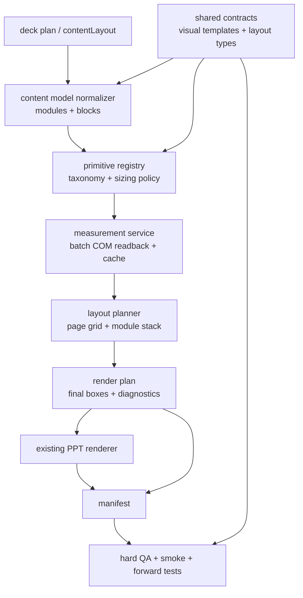

# refactor: Make Layout-Aware Rendering a Foundation Capability

## Overview

The current branch proved that layout-aware, COM-measured Huawei PPT rendering can produce materially better output and pass forward tests. The next refactor is about turning that success from an implementation technique inside `hw_visual_anchor_slide.js` into a durable foundation capability.

The target architecture is:

```text
semantic slide content
-> shared visual/template contracts
-> normalized content model
-> primitive registry and sizing policy
-> batch COM measurement
-> page/module layout planner
-> renderer consumes final boxes
-> manifest + QA + forward-test evidence
```

This is not another renderer rewrite. It preserves the existing Huawei PPT renderer, PowerPoint COM measurement path, visual-anchor manifest, and forward-test workflow. The work is primarily boundary extraction, contract centralization, and removal of remaining bypass paths.

---

## Problem Frame

The repository now has the right capability, but not yet the right shape.

`scripts/pptx/layout/` contains useful layout primitives, measurement, stack allocation, diagnostics, and COM measurement support. However, the page entrypoint still carries too many responsibilities:

- `scripts/pptx/hw_visual_anchor_slide.js` normalizes `contentLayout`, owns fixed layout schemas, computes page/module areas, performs width allocation, picks block flow, warms measurement batches, renders blocks, writes manifest data, and contains text rendering helpers.
- Visual template metadata is duplicated across renderer routing, schema validation, taxonomy classification, composer role checks, and QA role checks.
- `biased_column` still uses a special rendering path rather than the same measured module/block pipeline.
- QA and smoke tests are strong, but some coverage is implementation-coupled or can be fooled by stale measurement cache.

The refactor should make "knows how to lay out content" a first-class subsystem, not a side effect of drawing a Huawei content slide.

---

## Requirements Trace

- R1. Preserve current generated deck behavior unless a change is explicitly needed to remove a bypass or fix architecture drift.
- R2. Establish a single code-level source of truth for visual template validity, renderer path, anchor eligibility, supporting-component status, measurement support, and sizing policy.
- R3. Establish a single code-level source of truth for supported `contentLayout.type` metadata and module count rules.
- R4. Extract content layout planning from `hw_visual_anchor_slide.js` into layout-owned modules that return final module/block boxes and diagnostics.
- R5. Keep PowerPoint COM measurement as the only layout measurement oracle for official body-content primitives; JavaScript estimates may remain only as renderer-local drawing aids or QA heuristics, not layout input.
- R6. Normalize `biased_column` into the same measured module/block pipeline as `two_column`, `three_column`, and `four_column`.
- R7. Remove or quarantine compatibility shims that silently classify unknown templates as measured real anchors.
- R8. Keep runtime schema semantic: generation agents write `contentLayout`, `visual_anchor`, `supporting_component`, and `text` blocks, not coordinates.
- R9. Keep manifest/QA enforcement aligned with the shared contracts; supporting components must never count as real anchors.
- R10. Strengthen tests so refactors prove behavior, not just presence of strings or exported function names.
- R11. Keep forward tests as the human-quality acceptance gate after smoke and COM measurement review.
- R12. Update `SKILL.md`, `README.md`, references, and architecture docs only after implementation and QA agree.

---

## Scope Boundaries

- Do not introduce HTML/CSS rendering, browser screenshots, a CSS parser, or a general layout solver in this phase.
- Do not restyle Huawei visuals while extracting architecture boundaries.
- Do not add new runtime schema fields for manual coordinates, column widths, gutters, or component placement.
- Do not split large files just for file-size aesthetics before shared contracts are centralized.
- Do not remove PowerPoint COM measurement or add silent non-COM fallbacks.
- Do not put implementation rationale into `SKILL.md`; keep development architecture in `docs/` and runtime guidance in `SKILL.md`.

### Deferred to Follow-Up Work

- Splitting `hw_diagram_helpers.js` by renderer family after template facts are centralized.
- Replacing the simple layout planner with an external solver if fixed-family planning becomes insufficient.
- OCR/image-density evidence readability scoring.
- Fully modularizing `scripts/qa/check_huawei_pptx.js` beyond the contract imports needed for this refactor.

---

## Context & Research

### Relevant Code and Patterns

- `docs/architecture_design.md`: current architecture contract and COM broker requirement.
- `SKILL.md`: runtime instructions; currently mostly aligned with layout-aware generation.
- `references/content_layout_schema.md`: runtime-facing `contentLayout` schema.
- `references/content_body_taxonomy.md`: body-content taxonomy; currently active but not fully listed in architecture docs.
- `references/huawei_layout_primitives.md`: measurement and diagnostic reference.
- `scripts/pptx/hw_visual_anchor_slide.js`: current content-slide entrypoint and main extraction target.
- `scripts/pptx/layout/content_body_taxonomy.js`: current taxonomy registry, but incomplete as a shared renderer/QA contract.
- `scripts/pptx/layout/measure_primitives.js`: current measured primitive sizing and sizing policy.
- `scripts/pptx/layout/stack_layout.js`: current module stack allocator.
- `scripts/pptx/layout/powerpoint_measurement_provider.js`: batch COM measurement facade and cache.
- `scripts/pptx/layout/powerpoint_measurement_worker.js`: probe deck renderer for COM measurement.
- `scripts/pptx/hw_diagram_helpers.js`: renderer routing and visual-anchor validation.
- `scripts/qa/check_huawei_pptx.js`: hard QA, including manifest, layout, brief, and render checks.
- `scripts/smoke/layout/test_powerpoint_measurement_harness.js`: canonical COM measurement quality guard.
- `scripts/smoke/generate_content_layout_schema_smoke.js`: content layout integration smoke.
- `forward-tests/huawei-ppt-gen/aegaeon-content-aware-layout`: forward-test gate for content-aware layout.
- `forward-tests/huawei-ppt-gen/tidar-evidence-readability`: forward-test gate for evidence readability.

### Findings from Architecture Review

- `hw_visual_anchor_slide.js` currently binds layout foundation logic to page rendering.
- Visual kind/template facts are duplicated across renderer, taxonomy, composer, QA, and references.
- `biased_column` still bypasses the normal measured module/block path.
- Layout measurement cache can hide renderer changes if cache versioning is not controlled.
- Some smoke tests assert strings and exported surfaces rather than behavior.
- Documentation is close, but `docs/architecture_design.md` omits `references/content_body_taxonomy.md`, and `README.md` omits the TiDAR forward-test fixture from its inventory.

### External References

- No external research is required for this phase. The repo already has the necessary local patterns, and the user has explicitly prioritized the existing PPT renderer path.

---

## Key Technical Decisions

- **Centralize facts before splitting files.** The most dangerous drift is duplicated semantic metadata, not physical file length.
- **Use shared contract modules, not docs, as runtime facts.** Docs explain contracts; renderer, layout, and QA import the same JavaScript contract source.
- **Keep COM measurement authoritative.** Official primitive layout measurement must continue to use PowerPoint COM readback through the broker.
- **Separate layout planning from rendering.** Layout modules produce boxes and diagnostics; renderers consume boxes and do not renegotiate placement.
- **Normalize biased column as layout, not renderer special-case.** The visual area can be special; the module/block rendering path should not be.
- **Treat forward tests as acceptance, not unit tests.** Smoke catches regressions; forward tests prove the Skill still yields good decks under isolated agent execution.

---

## Output Structure

Proposed target shape:

```text
scripts/pptx/contracts/
  visual_templates.js
  content_layout_types.js

scripts/pptx/layout/
  content_model.js
  geometry.js
  primitive_registry.js
  sizing_policy.js
  measurement_service.js
  content_layout_planner.js
  render_plan.js
  stack_layout.js
  diagnostics.js

scripts/pptx/
  hw_visual_anchor_slide.js
  hw_diagram_helpers.js
  hw_pptx_helpers.js
  measure_pptx_layout.js
  powerpoint_com_broker.js
```

This structure is directional. Implementers may merge `primitive_registry.js` and `sizing_policy.js` initially if the separation creates churn, but the ownership boundary should remain clear.

---

## High-Level Technical Design

> This illustrates the intended approach and is directional guidance for review, not implementation specification.



The desired dependency direction:

```text
contracts
  -> content model
  -> primitive registry
  -> measurement service
  -> layout planner
  -> content-slide composer
  -> renderer
  -> manifest / QA
```

QA may import contracts for validation, but contracts must not import renderer, QA, or smoke fixtures.

---

## Implementation Units

- U1. **Create Shared Visual Template Contract**

**Goal:** Make kind/template metadata a single source of truth for renderer, layout, and QA.

**Requirements:** R2, R7, R9

**Dependencies:** None

**Files:**
- Create: `scripts/pptx/contracts/visual_templates.js`
- Modify: `scripts/pptx/layout/content_body_taxonomy.js`
- Modify: `scripts/pptx/hw_diagram_helpers.js`
- Modify: `scripts/pptx/hw_visual_anchor_slide.js`
- Modify: `scripts/qa/check_huawei_pptx.js`
- Test: `scripts/smoke/layout/test_content_body_taxonomy.js`
- Test: `scripts/smoke/layout/test_taxonomy_coverage_contract.js`
- Test: `scripts/smoke/test_visual_anchor_content_contract.js`

**Approach:**
- Define each official `kind/template` once with:
  - `kind`
  - `template`
  - `family`
  - `type`
  - `renderer`
  - `anchorEligibility`
  - `measureSupport`
  - `resizePolicy`
  - supporting-component flag
  - expected output class where needed
- Replace composer and QA checks such as "is structured supporting component" with contract lookups.
- Replace renderer validation's duplicate valid-template maps with contract lookups.
- Remove or quarantine `KIND_DEFAULTS` so known-kind/unknown-template does not become measured by accident.

**Patterns to follow:**
- Existing metadata in `scripts/pptx/layout/content_body_taxonomy.js`.
- Existing render-path mapping in `scripts/pptx/hw_diagram_helpers.js`.
- Existing supporting-component checks in `scripts/qa/check_huawei_pptx.js`.

**Test scenarios:**
- Happy path: every official visual template resolves to exactly one renderer and one taxonomy entry.
- Happy path: `Quantity/data_cards`, `Matrix/table`, `Matrix/capability_matrix`, `Matrix/heatmap`, and `Hierarchy/capability_stack` resolve as supporting components, not real anchors.
- Happy path: Evidence templates resolve as real anchors with preserve-aspect measurement policy.
- Error path: `Sequence/unknown` is unsupported, not a measured default.
- Error path: `Network/unknown` is unsupported, not a measured default.
- Integration: QA and composer agree on whether a manifest entry is a real anchor or supporting component.

**Verification:**
- A new template cannot be accepted by renderer while missing from taxonomy or QA.

---

- U2. **Create Shared Content Layout Type Contract**

**Goal:** Remove duplicated layout type facts between composer and QA.

**Requirements:** R3, R8, R9

**Dependencies:** None

**Files:**
- Create: `scripts/pptx/contracts/content_layout_types.js`
- Modify: `scripts/pptx/hw_visual_anchor_slide.js`
- Modify: `scripts/qa/check_huawei_pptx.js`
- Modify: `references/content_layout_schema.md`
- Test: `scripts/smoke/test_visual_anchor_content_contract.js`
- Test: `scripts/smoke/test_qa_rule_regressions.js`

**Approach:**
- Move layout type metadata out of `hw_visual_anchor_slide.js` and `check_huawei_pptx.js`:
  - `two_column`
  - `biased_column`
  - `three_column`
  - `four_column`
  - module count rules
  - fixed reference names
  - grid/special layout metadata
- Make both normalization and QA import the same metadata.
- Keep runtime schema unchanged.

**Patterns to follow:**
- Current `CONTENT_LAYOUT_SCHEMAS` in `scripts/pptx/hw_visual_anchor_slide.js`.
- Current `CONTENT_LAYOUT_SCHEMA_RULES` in `scripts/qa/check_huawei_pptx.js`.

**Test scenarios:**
- Happy path: each supported layout type normalizes and passes QA with the same expected module count.
- Error path: invalid layout type fails in composer and QA with consistent wording/category.
- Error path: wrong module count fails from shared metadata.
- Integration: changing a layout reference in the contract changes composer and QA expectations together.

**Verification:**
- No independent layout type map remains in composer or QA.

---

- U3. **Extract Content Model Normalization**

**Goal:** Move module/block normalization and role classification out of the content-slide renderer.

**Requirements:** R4, R8

**Dependencies:** U1, U2

**Files:**
- Create: `scripts/pptx/layout/content_model.js`
- Modify: `scripts/pptx/hw_visual_anchor_slide.js`
- Test: `scripts/smoke/test_visual_anchor_content_contract.js`
- Test: `scripts/smoke/layout/test_content_body_taxonomy.js`

**Approach:**
- Move or wrap:
  - `normalizeContentLayout`
  - `normalizeModuleBlocks`
  - strict visual-anchor counting
  - supporting-component role resolution
  - page-region override rejection
- The normalizer should return a renderer-neutral model:
  - layout type
  - modules
  - normalized blocks
  - visual role per block
  - contract-derived metadata
- The normalizer should not draw PPT shapes, read images, or call COM.

**Patterns to follow:**
- Current normalization and validation in `scripts/pptx/hw_visual_anchor_slide.js`.

**Test scenarios:**
- Happy path: `contentLayout.modules[].blocks[]` normalizes without changing block order.
- Happy path: legacy module with `role: "visual_anchor"` normalizes into a single visual block.
- Error path: root `contentArea` or `content_area` is rejected.
- Error path: direct `image` or `table` block is rejected or marked invalid before render.
- Error path: module with only supporting components does not satisfy strict anchor requirement.

**Verification:**
- `hw_visual_anchor_slide.js` receives a normalized model instead of doing schema interpretation inline.

---

- U4. **Extract Geometry and Placement Utilities**

**Goal:** Remove duplicated placement math between real rendering and measurement probes.

**Requirements:** R1, R5

**Dependencies:** None

**Files:**
- Create: `scripts/pptx/layout/geometry.js`
- Modify: `scripts/pptx/hw_visual_anchor_slide.js`
- Modify: `scripts/pptx/layout/powerpoint_measurement_worker.js`
- Test: `scripts/smoke/layout/test_module_stack_layout.js`
- Test: `scripts/smoke/layout/test_powerpoint_measurement_harness.js`

**Approach:**
- Move shared helpers such as contain placement and rectangle union/rounding where appropriate.
- Keep helper scope small. This unit should not become a dumping ground for renderer behavior.
- Use the same contain-placement rule for probe decks and real decks where the visual semantics match.

**Patterns to follow:**
- Existing `fitAreaContain` in `scripts/pptx/hw_visual_anchor_slide.js`.
- Existing `fitAreaContain` in `scripts/pptx/layout/powerpoint_measurement_worker.js`.

**Test scenarios:**
- Happy path: wide source image fits by width and preserves aspect ratio.
- Happy path: tall source image fits by height and preserves aspect ratio.
- Edge case: invalid zero dimensions fail loudly.
- Integration: measurement proof deck and real render use equivalent placement for image-backed probes.

**Verification:**
- Placement math is not duplicated between probe worker and content-slide composer.

---

- U5. **Introduce Layout Planner and Render Plan Boundary**

**Goal:** Make layout allocation a reusable subsystem that returns final boxes and diagnostics before drawing.

**Requirements:** R4, R5, R8

**Dependencies:** U1, U2, U3, U4

**Files:**
- Create: `scripts/pptx/layout/content_layout_planner.js`
- Create: `scripts/pptx/layout/render_plan.js`
- Modify: `scripts/pptx/hw_visual_anchor_slide.js`
- Modify: `scripts/pptx/layout/stack_layout.js`
- Modify: `scripts/pptx/layout/adapters.js`
- Test: `scripts/smoke/layout/test_module_stack_layout.js`
- Test: `scripts/smoke/layout/test_tidar_three_column_primitives.js`
- Test: `scripts/smoke/generate_content_layout_schema_smoke.js`

**Approach:**
- Move page-level layout functions out of the renderer:
  - fixed content area calculation
  - column/four-grid/biased-grid module areas
  - evidence-aware column balancing
  - module width demand measurement
  - final stack measurement item collection
- Planner input:
  - normalized content model
  - fixed shell constraints such as body top and footer boundary
  - measurement session
- Planner output:
  - module areas
  - block areas
  - layout status
  - layout diagnostics
  - measure descriptors
  - render plan consumable by `hw_visual_anchor_slide.js`
- `hw_visual_anchor_slide.js` should draw shell, call planner, render blocks into final boxes, and write manifest.

**Patterns to follow:**
- Current `contentLayoutAreas`, `resolveEvidenceAwareColumnLayout`, `measureModuleWidthDemand`, `collectFinalStackMeasurementItems`, and `addContentPanelModule` logic.
- Current `layoutModuleStack` result shape in `scripts/pptx/layout/stack_layout.js`.

**Test scenarios:**
- Happy path: three-column page produces three module areas and per-block render boxes.
- Happy path: evidence-aware width balancing gives wider columns to modules with larger measured width demand without changing layout family.
- Edge case: four-column grid bypasses column balancing and uses fixed grid cells.
- Error path: infeasible module returns hard diagnostics before drawing.
- Integration: content-layout smoke includes layout budget and primitive diagnostics in manifest.

**Verification:**
- The layout planner can be called without constructing a PPT slide object.

---

- U6. **Normalize Biased Column into the Unified Pipeline**

**Goal:** Remove the special biased-column rendering model while preserving the visual style.

**Requirements:** R1, R6, R8, R9

**Dependencies:** U5

**Files:**
- Modify: `scripts/pptx/hw_visual_anchor_slide.js`
- Modify: `scripts/pptx/layout/content_layout_planner.js`
- Modify: `scripts/smoke/generate_content_layout_schema_smoke.js`
- Modify: `scripts/smoke/test_visual_anchor_content_contract.js`
- Test: `scripts/smoke/layout/test_module_stack_layout.js`

**Approach:**
- Keep biased-column area allocation special: large first module plus right-side stacked modules.
- Remove separate semantics in `addBiasedVisualOnlyModule` and `addBiasedSideCard` from the runtime path.
- Represent right-side cards as regular `text` blocks or supporting components inside normal module frames.
- Ensure biased-column modules emit the same measure/layout descriptors as other layouts.
- Preserve compatibility only if needed for old tests, with explicit internal/test-only naming.

**Patterns to follow:**
- Current visual look of `renderBiasedContentLayout`.
- Normal `addContentPanelModule` path for measured module rendering.

**Test scenarios:**
- Happy path: biased-column first module renders source evidence through the normal visual block path.
- Happy path: right-side cards render through measured text/supporting-component blocks.
- Error path: biased-column first module without a real anchor fails.
- Integration: biased-column manifest includes module layouts and block descriptors comparable to other layouts.

**Verification:**
- `biased_column` differs by area allocation only, not by a separate rendering model.

---

- U7. **Clarify Measurement Service and Cache Semantics**

**Goal:** Keep COM measurement authoritative while reducing stale-cache and coupling risks.

**Requirements:** R5, R10

**Dependencies:** U1, U5

**Files:**
- Create or rename: `scripts/pptx/layout/measurement_service.js`
- Modify: `scripts/pptx/layout/powerpoint_measurement_provider.js`
- Modify: `scripts/pptx/layout/measure_primitives.js`
- Modify: `scripts/smoke/layout/test_powerpoint_measurement_harness.js`
- Test: `scripts/smoke/layout/test_primitive_measurement.js`
- Test: `scripts/smoke/layout/test_all_official_primitive_measurement.js`

**Approach:**
- Keep PowerPoint provider as the only production measurement adapter.
- Make layout code depend on a measurement service interface rather than provider internals.
- Include renderer/contract versioning in cache invalidation strategy.
- Provide a documented way for canonical COM measurement tests to bypass or refresh stale disk cache.
- Preserve batch measurement as the default path.

**Patterns to follow:**
- Existing session and disk cache in `powerpoint_measurement_provider.js`.
- Existing batch worker path through `powerpoint_measurement_worker.js`.
- Existing broker path through `measure_pptx_layout.js`.

**Test scenarios:**
- Happy path: repeated measurement in one session hits session cache.
- Happy path: repeated measurement across sessions hits disk cache when version matches.
- Edge case: cache version/contract version change forces fresh measurement.
- Error path: non-Windows measurement fails loudly without fallback.
- Integration: batch measurement uses one worker call for multiple same-smoke items.

**Verification:**
- Primitive tests cannot silently pass from stale cache after renderer contract changes.

---

- U8. **Clean Up Renderer Dispatch and Dead Branches**

**Goal:** Remove misleading unreachable branches once shared contracts own renderer routing.

**Requirements:** R1, R2, R7

**Dependencies:** U1

**Files:**
- Modify: `scripts/pptx/hw_diagram_helpers.js`
- Test: `scripts/smoke/test_diagram_helpers.js`
- Test: `scripts/smoke/verify_diagram_components.js`
- Test: `scripts/smoke/layout/test_powerpoint_measurement_harness.js`

**Approach:**
- Use shared contract renderer values to route:
  - native PPT renderers
  - image/SVG renderers
  - evidence renderers
- Remove branches that cannot be reached because the function rejects that renderer path first.
- Keep reusable drawing helpers only if they are called by reachable code.
- Add tests that every contracted renderer path is reachable and every implemented renderer has at least one guard case.

**Patterns to follow:**
- Current `resolveVisualAnchorRenderPath`.
- Current `TEMPLATE_RENDERERS` behavior, migrated into shared contracts.

**Test scenarios:**
- Happy path: native PPT templates render through native branch.
- Happy path: SVG/image templates render through image branch.
- Error path: renderer mismatch fails with template id and expected renderer.
- Integration: COM measurement guard still covers every measured renderer template.

**Verification:**
- No production branch remains that claims to render templates that contract routing can never send there.

---

- U9. **Strengthen QA and Smoke Tests Around Architecture Boundaries**

**Goal:** Convert current fragile or string-based tests into behavior-backed guards where it matters.

**Requirements:** R9, R10, R11

**Dependencies:** U1, U2, U5, U6, U7

**Files:**
- Modify: `scripts/smoke/test_visual_anchor_content_contract.js`
- Modify: `scripts/smoke/test_qa_rule_regressions.js`
- Modify: `scripts/smoke/generate_content_layout_schema_smoke.js`
- Modify: `scripts/qa/check_huawei_pptx.js`
- Create: `scripts/smoke/layout/test_com_broker_queue.js`
- Create or extend: `scripts/smoke/layout/test_final_layout_readback.js`
- Modify: `package.json`

**Approach:**
- Keep useful smoke coverage but reduce tests that only search for strings or exported names.
- Add behavior tests for:
  - known-kind/unknown-template negative taxonomy cases;
  - supporting-component-only page/module failing anchor requirements;
  - final PPT readback or manifest geometry consistency for representative content layout pages;
  - COM broker serialized queue handling under concurrent requests.
- Fix content-layout smoke plan generation so `visual_anchors` does not blur strict anchors and supporting components.
- Ensure tests remain right-sized; forward-test visual quality remains a separate gate.

**Patterns to follow:**
- Existing QA issue style in `check_huawei_pptx.js`.
- Existing COM measurement harness proof deck.
- Existing forward-test artifact expectations.

**Test scenarios:**
- Error path: `Sequence/unknown` and `Network/unknown` fail taxonomy support.
- Error path: page with only `Quantity/data_cards` and `Matrix/table` fails strict anchor requirement.
- Error path: module with only supporting components fails module anchor requirement.
- Integration: final layout readback confirms representative rendered bounds are inside planned block/module boxes.
- Integration: concurrent broker requests are serialized and all complete without racing PowerPoint.

**Verification:**
- Tests prove contract behavior and final geometry, not only that files contain expected strings.

---

- U10. **Update Documentation and Runtime Guidance**

**Goal:** Align architecture docs, references, README, and SKILL with the extracted foundation.

**Requirements:** R11, R12

**Dependencies:** U1 through U9

**Files:**
- Modify: `docs/architecture_design.md`
- Modify: `references/content_body_taxonomy.md`
- Modify: `references/huawei_layout_primitives.md`
- Modify: `references/content_layout_schema.md`
- Modify: `README.md`
- Modify: `SKILL.md`

**Approach:**
- Add `references/content_body_taxonomy.md` to architecture-owned reference contracts.
- Document the new shared contract modules and layout planner boundaries.
- Update README forward-test inventory to include both Aegaeon and TiDAR.
- Keep `SKILL.md` runtime-focused:
  - agents write semantic content, not coordinates;
  - layout is measured before drawing;
  - diagnostics should be handled by simplifying content, splitting claims, or using supporting components correctly;
  - shell/chrome remains fixed and brief-derived.
- Avoid exposing implementation internals as authoring instructions.

**Patterns to follow:**
- Runtime/development split in `AGENTS.md`.
- Existing "Load First" and "Runtime Script Map" sections in `SKILL.md`.

**Test scenarios:**
- Integration: docs mention the same contract names as implementation and tests.
- Integration: README lists all forward-test fixtures.
- Error path: SKILL does not recommend manual coordinates or direct image/table bypasses.

**Verification:**
- A new agent can understand the architecture from docs without being told old context from this conversation.

---

## Phased Delivery

### Phase 1: Contract Centralization

- U1 shared visual template contract.
- U2 shared content layout type contract.
- U3 content model normalizer.
- U4 geometry utility extraction.

This phase should minimize rendering behavior changes. It exists to stop fact drift before moving more code.

### Phase 2: Layout Foundation Extraction

- U5 layout planner and render plan boundary.
- U6 biased-column unification.
- U7 measurement service/cache semantics.

This phase turns layout-aware rendering into a real subsystem.

### Phase 3: Cleanup and Guardrails

- U8 renderer dead branch cleanup.
- U9 QA and smoke hardening.
- U10 documentation/SKILL alignment.

This phase removes misleading code and makes the new architecture durable.

---

## System-Wide Impact

- **Interaction graph:** generation scripts still call `addVisualAnchorContentSlide`; internally that entrypoint becomes shell + layout planner + render plan consumer.
- **Error propagation:** unknown templates, unsupported layout primitives, COM measurement failures, and infeasible layouts should fail loudly with contract-backed diagnostics.
- **State lifecycle risks:** measurement cache must not hide renderer changes; cache versioning and test refresh behavior must be explicit.
- **API surface parity:** renderer, layout, QA, smoke, references, and SKILL must agree on visual template semantics and supporting-component status.
- **Integration coverage:** smoke validates contracts and geometry; COM measurement review validates measurement; forward tests validate actual deck quality.
- **Unchanged invariants:** source images enter through Evidence; supporting components do not count as anchors; brief-derived title/title note/summary/footer remain shell-owned; PowerPoint COM broker remains the only Windows COM entrypoint.

---

## Risks & Dependencies

| Risk | Likelihood | Impact | Mitigation |
|---|---:|---:|---|
| Contract centralization changes renderer behavior accidentally | Medium | High | Phase U1 should include parity tests before deleting old maps. |
| Splitting files creates abstractions without reducing drift | Medium | Medium | Centralize facts first; split behavior only where ownership is clear. |
| Biased-column unification changes visual style | Medium | High | Preserve area allocation and compare content-layout smoke/forward PNGs. |
| Measurement cache hides broken renderer behavior | Medium | High | Include contract/cache version in keys and allow canonical tests to refresh. |
| QA becomes too coupled to implementation internals | Medium | Medium | QA imports contracts, not planner internals; final manifest remains the validation surface. |
| COM broker concurrency test is flaky on local PowerPoint | Medium | Medium | Keep the test small and use broker queue requests, not heavy deck generation. |
| Forward tests regress because SKILL guidance changes too early | Low | High | Update SKILL after implementation and smoke are stable, not before. |

---

## Success Metrics

- `hw_visual_anchor_slide.js` no longer owns layout schema metadata, page grid planning, module width allocation, or content model normalization.
- Renderer, layout, and QA import the same visual template contract.
- Composer and QA import the same content layout type contract.
- `biased_column` emits measured module/block descriptors through the same pipeline as other layouts.
- Known-kind/unknown-template cases fail as unsupported.
- COM measurement tests cannot pass from stale cache after contract/renderer version changes.
- `npm run smoke` passes.
- `npm run com-measurement-review` produces the review PPTX/PNGs.
- Forward tests pass:
  - `forward-tests/huawei-ppt-gen/aegaeon-content-aware-layout`
  - `forward-tests/huawei-ppt-gen/tidar-evidence-readability`

---

## Verification Plan

Minimum local checks after implementation:

- `npm run test:layout`
- `npm run test:powerpoint-measurement`
- `npm run content-layout-smoke`
- `npm run test:visual-anchor-contract`
- `npm run test:qa-rules`
- `npm run test:powerpoint-com`
- `npm run smoke`

Human/visual acceptance:

- `npm run com-measurement-review`
- Inspect exported PNGs from `.tmp/com_measurement_quality_guard/png/`.
- Run both forward-test fixtures with isolated candidate agents and write `judgment.md` for each run.

---

## Documentation / Operational Notes

- This plan supersedes the remaining "make layout primitives measured" planning work after the COM measurement implementation landed.
- The previous plan `docs/plans/2026-05-28-002-refactor-huawei-layout-primitives-plan.md` remains historical context for why measurement exists.
- Do not execute this plan by making broad formatting or mechanical moves first. The first code change should establish shared contracts and tests.
- Keep PowerPoint processes serialized through `scripts/pptx/powerpoint_com_broker.js` and `scripts/pptx/powerpoint_com_broker.ps1`.

---

## Sources & References

- Related issue: `https://github.com/MozhiJiawei/hw-ppt-gen/issues/20`
- Architecture contract: `docs/architecture_design.md`
- Historical primitive plan: `docs/plans/2026-05-28-002-refactor-huawei-layout-primitives-plan.md`
- Runtime skill: `SKILL.md`
- Content layout schema: `references/content_layout_schema.md`
- Body taxonomy reference: `references/content_body_taxonomy.md`
- Layout primitives reference: `references/huawei_layout_primitives.md`
- Content-slide composer: `scripts/pptx/hw_visual_anchor_slide.js`
- Visual renderer: `scripts/pptx/hw_diagram_helpers.js`
- Layout modules: `scripts/pptx/layout/`
- Hard QA: `scripts/qa/check_huawei_pptx.js`
- COM measurement guard: `scripts/smoke/layout/test_powerpoint_measurement_harness.js`
- Aegaeon forward test: `forward-tests/huawei-ppt-gen/aegaeon-content-aware-layout`
- TiDAR forward test: `forward-tests/huawei-ppt-gen/tidar-evidence-readability`
