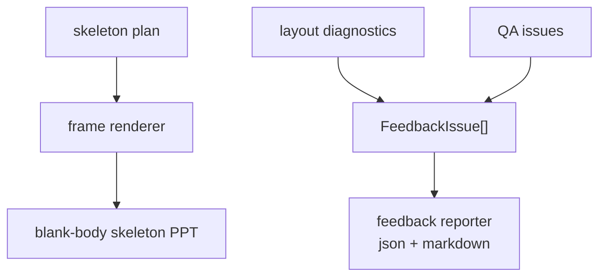

# refactor: Stabilize Frame Plan and Feedback Foundation

## Overview

This is Step 1 of the Frame Plan + Body DSL refactor. It does not change how creative body content is authored yet. It stabilizes the mechanical skeleton/frame layer and unifies existing layout diagnostics and QA issues under one FeedbackIssue shape.

Target flow for this step:

```text
skeleton plan
-> frame renderer
-> blank body skeleton PPT

layout diagnostics / QA issues
-> FeedbackIssue[]
-> JSON / Markdown / thrown summary
```

The goal is to make the current system easier for agents to repair without introducing the Body DSL yet.

---

## Problem Frame

The repository already has a useful skeleton smoke path in `scripts/smoke/test_ppt_skeleton_rendering.js`: a plan or brief can render cover, TOC, section tabs, title, title note, analysis summary, footer, and page number while leaving body content blank.

The repository also has strong measurement and QA checks, but their feedback is split across low-level layout diagnostics and QA issue objects. Those are good enforcement tools, but they are not yet a DevTools-like feedback surface for AI repair.

This step predates the final cleanup and introduced a single issue format that later DSL compilation, layout, render, and QA producers can all use.

---

## Requirements Trace

- R1. Preserve current generated deck behavior and forward-test behavior.
- R2. Keep skeleton plan limited to fields proven by the skeleton smoke path.
- R3. Keep body content, reference images, visual anchors, supporting components, delivery constraints, and body slot coordinates out of skeleton plan ownership.
- R4. Unify layout diagnostics and QA issues into a compatible FeedbackIssue shape without removing existing QA rules.
- R5. Provide JSON and Markdown reporting that groups feedback by slide/module/block and gives agents actionable repair context.
- R6. Keep `npm run smoke` and forward tests passing while later Body DSL work replaces the old body path.

---

## Scope Boundaries

- Do not introduce Body DSL in this step.
- Do not change the current content renderer or visual-anchor renderer behavior.
- Do not remove `bodyDsl` authoring yet.
- Do not rewrite hard QA rules; wrap or normalize their output.
- Do not put body slot geometry into the skeleton plan. The frame renderer computes it.

---

## Context & Research

### Relevant Code and Patterns

- `scripts/pptx/hw_ppt_skeleton.js`: skeleton plan normalization and skeleton deck renderer.
- `scripts/pptx/skeleton/page_skeleton.js`: fixed page chrome, analysis summary, body entrypoint, and footer.
- `scripts/smoke/test_ppt_skeleton_rendering.js`: skeleton smoke contract; body sentinel fields must not render.
- `scripts/smoke/fixtures/ppt_skeleton_plan.json`: plan-backed skeleton fixture.
- `scripts/pptx/layout/diagnostics.js`: existing low-level diagnostic helper.
- `scripts/pptx/layout/stack_layout.js`: emits layout diagnostics and measured box budgets.
- `scripts/qa/check_huawei_pptx.js`: current hard QA issue producer.
- `scripts/pptx/hw_visual_anchor_slide.js`: writes layout diagnostics and budgets into manifest metadata.

---

## Key Technical Decisions

- **Keep plan, but only for frame.** Skeleton plan remains the mechanical deck/frame/chrome contract.
- **Use skeleton smoke as the minimum dependency bar.** Preserve cover, TOC, sections, and per-slide page/title/title note/summary/current section/source fields.
- **Do not add a deep feedback architecture.** Introduce only a thin FeedbackIssue format and reporter.
- **Make existing QA a feedback producer.** Current QA rules remain authoritative, but their output becomes compatible with the same issue shape as layout diagnostics.

---

## High-Level Technical Design

> *This illustrates the intended approach and is directional guidance for review, not implementation specification. The implementing agent should treat it as context, not code to reproduce.*



Minimum skeleton plan:

```text
cover.title / subtitle / department / date
toc.title / items[].title / items[].note
sections[]
slides[].page
slides[].role
slides[].title
slides[].titleNote
slides[].summary
slides[].currentSection
slides[].source
```

FeedbackIssue shape:

```text
code
severity
phase
target
message
details
repairs[]
```

---

## Implementation Units

- U1. **Document Skeleton Plan Contract**

**Goal:** Make the frame-plan boundary explicit and preserve the current skeleton smoke contract.

**Requirements:** R1, R2, R3

**Dependencies:** None

**Files:**
- Create: `references/skeleton_plan_schema.md`
- Modify: `docs/architecture_design.md`
- Test: `scripts/smoke/test_ppt_skeleton_rendering.js`

**Approach:**
- Document the minimum skeleton fields from the existing smoke fixture.
- Document that body content, evidence, reference images, visual anchors, supporting components, delivery constraints, and body slot coordinates are outside skeleton plan scope.
- Keep the existing skeleton smoke as the contract test.

**Patterns to follow:**
- `scripts/pptx/hw_ppt_skeleton.js`
- `scripts/pptx/skeleton/page_skeleton.js`
- `scripts/smoke/fixtures/ppt_skeleton_plan.json`

**Test scenarios:**
- Happy path: skeleton fixture renders cover, TOC, summary, and content page chrome.
- Error path: `bodyContent` and `referenceImages` sentinel fields do not render.
- Integration: skeleton helper still routes content skeleton pages through `addVisualAnchorContentSlide`.

**Verification:**
- Skeleton smoke continues to pass and the contract is documented.

---

- U2. **Introduce FeedbackIssue Format**

**Goal:** Add a thin shared FeedbackIssue object that can represent compile, layout, render, and QA feedback.

**Requirements:** R4, R5

**Dependencies:** U1

**Files:**
- Create: `scripts/pptx/feedback/feedback_issue.js`
- Create: `scripts/pptx/feedback/feedback_reporter.js`
- Create: `scripts/smoke/test_feedback_issue_contract.js`
- Modify: `scripts/pptx/layout/diagnostics.js`

**Approach:**
- Keep existing `diagnostic()` compatibility while allowing richer fields such as `phase`, `target`, `box`, and `repairs`.
- Add normalizers for existing layout diagnostics and QA issues.
- Add reporter helpers for JSON and Markdown summaries.

**Patterns to follow:**
- `scripts/pptx/layout/diagnostics.js`
- `scripts/qa/check_huawei_pptx.js` issue object structure

**Test scenarios:**
- Happy path: a layout diagnostic normalizes into FeedbackIssue.
- Happy path: a QA issue normalizes into FeedbackIssue.
- Happy path: feedback Markdown groups issues by slide and severity.
- Edge case: legacy diagnostics without target/repairs still normalize.

**Verification:**
- Existing diagnostics remain usable, and new feedback reports can be generated without changing render behavior.

---

- U3. **Normalize QA Output Without Rewriting Rules**

**Goal:** Make hard QA issues compatible with FeedbackIssue while preserving existing QA enforcement.

**Requirements:** R1, R4, R5

**Dependencies:** U2

**Files:**
- Modify: `scripts/qa/check_huawei_pptx.js`
- Test: `scripts/smoke/test_feedback_issue_contract.js`
- Test: `scripts/smoke/test_visual_anchor_content_contract.js`

**Approach:**
- Upgrade the local `issue()` helper or add a wrapper so each QA issue carries FeedbackIssue-compatible fields.
- Preserve existing report shape where callers depend on it.
- Add structured `repairs` opportunistically for high-value current issues such as text too long, table frame too short, evidence too small, and missing real anchor.

**Patterns to follow:**
- Current QA issue creation in `scripts/qa/check_huawei_pptx.js`.

**Test scenarios:**
- Happy path: existing QA report still includes the same issue types and severities.
- Happy path: selected QA issues include phase, target, details, and repairs.
- Integration: smoke tests that parse QA output still pass.

**Verification:**
- `npm run smoke` passes and QA output can be consumed as FeedbackIssue.

---

## System-Wide Impact

- **Interaction graph:** Existing render and QA paths remain, but diagnostics and issues get a shared output format.
- **Error propagation:** Existing hard failures remain hard failures; feedback reporting adds agent-readable context.
- **API surface parity:** No body authoring surface changes in this step.
- **Integration coverage:** Existing smoke and forward tests prove no behavioral drift.
- **Unchanged invariants:** Skeleton plan does not render dynamic body content; supporting components still do not satisfy real anchors.

---

## Success Metrics

- Skeleton smoke still proves blank-body frame rendering.
- Layout diagnostics and QA issues can both normalize to FeedbackIssue.
- Feedback JSON/Markdown can be produced without changing deck rendering.
- Current smoke and forward tests continue to pass.

## Implementation Result

Implemented on 2026-05-31:

- documented the skeleton plan boundary in `references/skeleton_plan_schema.md` and `docs/architecture_design.md`;
- added `scripts/pptx/feedback/feedback_issue.js` and `scripts/pptx/feedback/feedback_reporter.js`;
- kept layout diagnostics backward-compatible while adding `FeedbackIssue` normalization;
- kept QA issue rules intact while adding `feedback_issues` and per-issue feedback metadata;
- added `scripts/smoke/test_feedback_issue_contract.js` and wired it into the software smoke report.
- follow-up review fixes: clarified `FeedbackIssue` as a cross-layer contract, preserved existing target fields during normalization, kept legacy QA issues in `qa` phase by default, expanded Markdown details, and added repair guidance for common chrome/style QA issues.

---

## Risks & Dependencies

| Risk | Mitigation |
|------|------------|
| FeedbackIssue becomes a second QA system | Keep it as a format/reporter only; existing producers own rules. |
| Skeleton plan grows again | Use skeleton smoke fixture as the minimum dependency contract. |
| QA callers break | Preserve existing QA report fields while adding compatible feedback fields. |

---

## Documentation / Operational Notes

- This step prepares the agent feedback loop but does not teach the Skill to write DSL yet.
- Runtime docs should remain mostly unchanged except for any skeleton plan contract references needed by maintainers.

---

## Sources & References

- Architecture contract: `docs/architecture_design.md`
- Skeleton renderer: `scripts/pptx/hw_ppt_skeleton.js`
- Skeleton page frame: `scripts/pptx/skeleton/page_skeleton.js`
- Skeleton smoke: `scripts/smoke/test_ppt_skeleton_rendering.js`
- Layout diagnostics: `scripts/pptx/layout/diagnostics.js`
- Hard QA: `scripts/qa/check_huawei_pptx.js`
