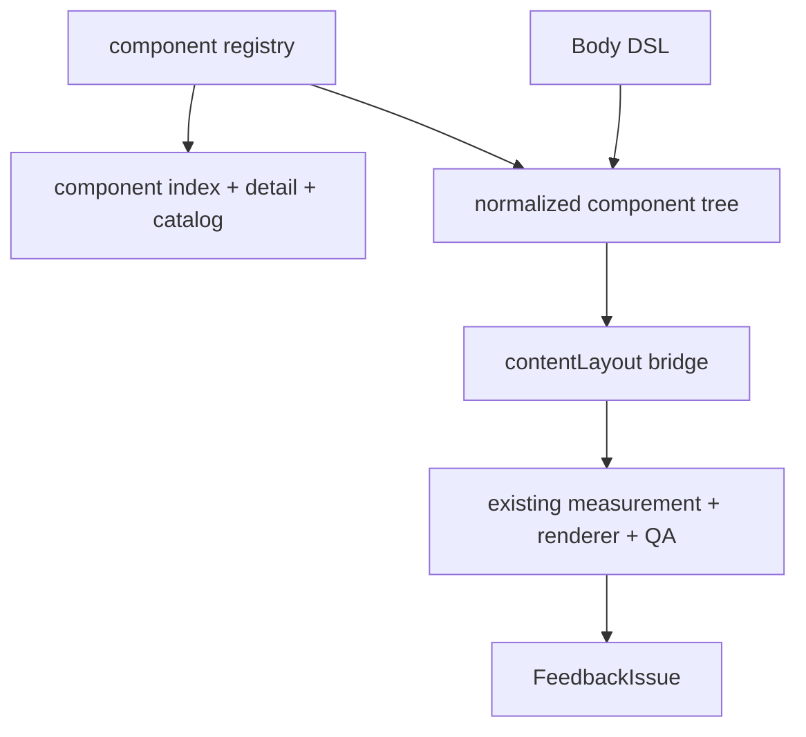

# refactor: Add Body DSL Registry Bridge

## Overview

This is Step 2 of the Frame Plan + Body DSL refactor. It introduces the AI-facing Body DSL, component registry, component discovery catalog, and compiler bridge into the existing `contentLayout` renderer path.

Target flow for this step:

```text
skeleton plan
-> frame / body slot
Body DSL
-> component registry
-> normalized component tree
-> current contentLayout modules/blocks
-> existing COM measurement/layout/render/QA
-> FeedbackIssue
```

This step changes the creative body authoring surface while deliberately keeping the existing renderer, measurement, manifest, and QA behavior.

---

## Problem Frame

Agents currently write body-oriented plan/contentLayout JSON. That makes creative body composition feel like filling a compliance form. The repository already has measured primitives, layout planning, visual templates, and hard QA. This step adds a web-like tree authoring layer so agents can compose body content with components while still compiling into the current stable renderer path.

---

## Requirements Trace

- R1. Provide a Body DSL authoring layer where agents compose the creative content region through registered components.
- R2. Create a component registry covering component tags, roles, kind/template mappings, props, measurement support, resize policy, maturity, AI visibility, docs, examples, budget hints, alternatives, and repair hints.
- R3. Expose a small, teachable AI-visible subset first; keep other atoms internal or experimental.
- R4. Generate AI-facing discovery outputs: component index, component detail, and generated component catalog.
- R5. Compile Body DSL into a normalized component tree.
- R6. Bridge normalized tree nodes into current `contentLayout` modules and blocks.
- R7. Preserve existing architecture invariants: evidence through `Evidence`, supporting components not real anchors, no manual coordinates, no direct image/table bypass.
- R8. Validate constrained layout intent such as `align`, `valign`, `fit`, `density`, `priority`, `maxLines`, and `maxItems` through registry contracts.
- R9. Keep smoke and forward tests passing, including the old plan path during migration.

---

## Scope Boundaries

- Do not introduce deck-local dynamic draw functions yet; that is Step 3.
- Do not remove old body plan/contentLayout authoring yet.
- Do not directly render from the component tree yet.
- Do not expose arbitrary CSS, page coordinates, z-index, raw percentages, or arbitrary style objects.
- Do not allow destructive evidence fitting such as stretch or crop-based cover.

---

## Context & Research

### Relevant Code and Patterns

- `scripts/pptx/contracts/visual_templates.js`: current visual contract seed.
- `scripts/pptx/contracts/content_layout_types.js`: current layout family contract.
- `scripts/pptx/layout/content_model.js`: current `contentLayout` normalization.
- `scripts/pptx/layout/measure_primitives.js`: COM-backed primitive measurement.
- `scripts/pptx/layout/content_layout_planner.js`: measured layout planning.
- `scripts/pptx/hw_visual_anchor_slide.js`: existing content slide renderer and bridge target.
- `references/content_layout_schema.md`: current runtime authoring schema, to become bridge/IR guidance.
- `scripts/smoke/test_visual_anchor_content_contract.js`: content layout contract smoke.
- `scripts/smoke/layout/test_taxonomy_coverage_contract.js`: taxonomy/contract coverage pattern.

---

## Key Technical Decisions

- **Bridge first, replace later.** Body DSL compiles into current `contentLayout` so existing render/QA behavior remains stable.
- **Registry is the source of truth.** DSL validation, catalog generation, bridge behavior, measurement metadata, and QA expectations should consume registry facts.
- **Generated docs teach choice.** Catalog entries include purpose, use-when, avoid-when, examples, budget hints, alternatives, and repair hints.
- **Layout intent is constrained.** Registry contracts decide which alignment/fit/density props a component supports.
- **High-level sugar compiles to a common visual form.** `ProcessFlow(...)` and low-level `Visual(draw, model)` should normalize into the same internal shape for official draw functions.

---

## High-Level Technical Design

> *This illustrates the intended approach and is directional guidance for review, not implementation specification. The implementing agent should treat it as context, not code to reproduce.*



Allowed DSL-level layout intent:

```text
align / valign
fit: contain | fill | cover | stretch
density
priority
maxLines / maxItems / maxCards
```

Rejected body DSL style:

```text
absolute x/y
raw width/height percentages
z-index
arbitrary margins/padding
page coordinates
```

---

## Output Structure

```text
scripts/pptx/dsl/
  component_registry.js
  compile_slide_dsl.js
  normalize_component_tree.js
  content_layout_bridge.js
  list_components.js
  describe_component.js
  generate_component_catalog.js

references/
  generated_dsl_component_catalog.md
  slide_dsl_authoring_schema.md

scripts/smoke/dsl/
  test_component_registry.js
  test_component_discovery_catalog.js
  test_dsl_content_layout_bridge.js
  test_generated_component_catalog.js
  test_dsl_feedback_contract.js
```

---

## Implementation Units

- U1. **Define Body DSL Authoring Contract**

**Goal:** Document the body-only DSL contract and its relationship to skeleton plan and `contentLayout` bridge output.

**Requirements:** R1, R6, R7, R8

**Dependencies:** Step 1 FeedbackIssue foundation

**Files:**
- Create: `references/slide_dsl_authoring_schema.md`
- Modify: `docs/architecture_design.md`
- Modify: `references/content_layout_schema.md`

**Approach:**
- Define Body DSL as the creative region below the frame/summary band.
- State that `contentLayout` is bridge/IR during migration.
- Document supported layout intent and rejected CSS-like props.

**Patterns to follow:**
- `references/content_layout_schema.md`
- `docs/architecture_design.md`

**Test scenarios:**
- Test expectation: none -- this unit documents the bridge contract; later units validate behavior.

**Verification:**
- Maintainers can distinguish skeleton plan, Body DSL, normalized tree, and current `contentLayout` bridge.

---

- U2. **Create Component Registry and Discovery Metadata**

**Goal:** Register official components and existing visual templates with maturity, AI visibility, docs, examples, budget hints, alternatives, repair hints, and layout intent contracts.

**Requirements:** R2, R3, R7, R8

**Dependencies:** U1

**Files:**
- Create: `scripts/pptx/dsl/component_registry.js`
- Modify: `scripts/pptx/contracts/visual_templates.js`
- Test: `scripts/smoke/dsl/test_component_registry.js`

**Approach:**
- Seed entries from `officialVisualTemplateRows()`.
- Add text and layout container entries outside visual template contracts.
- Start with a small AI-visible set such as evidence, insight text, KPI cards, table, process, timeline, dependency graph, and low-level official `Visual`.
- Keep other atoms `internal` or `experimental`.
- Add component-level layout intent contracts.

**Patterns to follow:**
- `scripts/pptx/contracts/visual_templates.js`
- `scripts/pptx/contracts/content_layout_types.js`
- `scripts/pptx/layout/content_body_taxonomy.js`

**Test scenarios:**
- Happy path: Evidence is discoverable as real-anchor, measured, preserve-aspect, `fit=contain`.
- Happy path: KPI cards/table/capability stack are supporting components, not real anchors.
- Happy path: internal entries are registry-valid but AI-hidden.
- Error path: AI-visible component without docs/examples/selection hints fails smoke.
- Error path: `EvidenceFigure fit=stretch` is rejected.
- Error path: arbitrary `style` or coordinate props are rejected.

**Verification:**
- Registry can drive validation, catalog, bridge, and QA expectations without duplicated lists.

---

- U3. **Generate Component Discovery Outputs**

**Goal:** Generate the AI-facing component index, component detail output, and catalog from registry declarations.

**Requirements:** R3, R4

**Dependencies:** U2

**Files:**
- Create: `scripts/pptx/dsl/list_components.js`
- Create: `scripts/pptx/dsl/describe_component.js`
- Create: `scripts/pptx/dsl/generate_component_catalog.js`
- Create: `references/generated_dsl_component_catalog.md`
- Test: `scripts/smoke/dsl/test_component_discovery_catalog.js`
- Test: `scripts/smoke/dsl/test_generated_component_catalog.js`

**Approach:**
- `list_components` returns a concise candidate selection view.
- `describe_component` returns schema, examples, budget hints, alternatives, repair hints, and layout intent.
- Generated catalog groups by layout, visual anchors, supporting components, text, and official `Visual` escape hatch.

**Patterns to follow:**
- `references/generated_visual_schema.md` examples, but with AI-facing component usage instead of raw visual spec as the primary surface.

**Test scenarios:**
- Happy path: index lists only AI-visible official/experimental components.
- Happy path: detail includes use/avoid guidance, schema, examples, budgets, alternatives, and repair hints.
- Happy path: catalog documents official `Visual(role, claim, draw, model)` as an escape hatch for existing official draw functions.
- Error path: internal components are absent from discovery outputs.

**Verification:**
- Agents can choose components without reading the whole registry.

---

- U4. **Compile DSL to Normalized Component Tree**

**Goal:** Validate Body DSL source against registry contracts and produce a normalized tree with source mapping.

**Requirements:** R1, R5, R7, R8

**Dependencies:** U2, U3

**Files:**
- Create: `scripts/pptx/dsl/compile_slide_dsl.js`
- Create: `scripts/pptx/dsl/normalize_component_tree.js`
- Test: `scripts/smoke/dsl/test_dsl_content_layout_bridge.js`
- Test: `scripts/smoke/dsl/test_dsl_feedback_contract.js`

**Approach:**
- Start with the safest syntax that supports representative tree fixtures.
- Normalize every node to tag, role, props, children, registry contract, source path, and source location where available.
- Validate required props, children, real-anchor presence, official draw ids, and layout intent.
- Produce FeedbackIssue on compile errors.

**Patterns to follow:**
- `scripts/pptx/layout/content_model.js`
- Step 1 `FeedbackIssue`

**Test scenarios:**
- Happy path: two-column DSL with evidence, KPI cards, and insight text normalizes.
- Happy path: official `Visual(draw="sequence.process")` normalizes.
- Error path: unknown component tag produces source-mapped FeedbackIssue.
- Error path: table-only module fails real-anchor requirement.
- Error path: unsupported layout prop fails before measurement.

**Verification:**
- Invalid DSL fails before render with actionable feedback.

---

- U5. **Bridge Component Tree to Current Content Layout**

**Goal:** Convert normalized DSL trees into current `contentLayout` modules and blocks.

**Requirements:** R5, R6, R7, R9

**Dependencies:** U4

**Files:**
- Create: `scripts/pptx/dsl/content_layout_bridge.js`
- Modify: `scripts/pptx/layout/content_model.js`
- Modify: `scripts/pptx/hw_visual_anchor_slide.js`
- Test: `scripts/smoke/dsl/test_dsl_content_layout_bridge.js`
- Test: `scripts/smoke/test_visual_anchor_content_contract.js`

**Approach:**
- Map layout tags to `contentLayout.type`.
- Map visual-anchor components to `visual_anchor` blocks.
- Map supporting components to `supporting_component` blocks.
- Map text components to `text` blocks.
- Map official `Visual(draw, model)` to current `kind/template/visual_spec`.

**Patterns to follow:**
- `references/content_layout_schema.md`
- `scripts/pptx/layout/content_model.js`
- `scripts/pptx/contracts/content_layout_types.js`

**Test scenarios:**
- Happy path: DSL two-column page compiles to valid current `contentLayout`.
- Happy path: official generated visual entered through DSL counts as a real anchor.
- Error path: supporting-only module fails real-anchor validation.
- Integration: bridged output passes `normalizeContentLayout()`.

**Verification:**
- A DSL-authored slide can use the existing renderer, manifest, QA, and smoke path.

---

- U6. **Run DSL Forward Fixture Through Existing Pipeline**

**Goal:** Add at least one DSL-authored forward fixture while keeping old forward fixtures passing.

**Requirements:** R1, R9

**Dependencies:** U5

**Files:**
- Create or modify: `forward-tests/huawei-ppt-gen/*`
- Modify: `scripts/quality/software_test_report.js`
- Test: `scripts/smoke/dsl/test_dsl_feedback_contract.js`

**Approach:**
- Add a representative page authored with skeleton plan + Body DSL.
- Compile it through the bridge into the old renderer path.
- Require existing QA and new FeedbackIssue reporting to pass.

**Patterns to follow:**
- Existing forward-test structure under `forward-tests/huawei-ppt-gen/`.

**Test scenarios:**
- Integration: old plan-authored forward tests still pass.
- Integration: new DSL-authored fixture renders editable PPT and passes QA.
- Error path: broken DSL fixture produces FeedbackIssue rather than bare throw.

**Verification:**
- Step 2 can ship without changing final renderer quality.

---

## System-Wide Impact

- **Interaction graph:** Body DSL sits above existing content model and renderer.
- **Error propagation:** Compile and bridge failures become FeedbackIssue.
- **API surface parity:** Old body `contentLayout` remains supported during migration.
- **Integration coverage:** DSL smoke plus forward fixture proves the new authoring path works.
- **Unchanged invariants:** Evidence and supporting component boundaries remain unchanged.

---

## Success Metrics

- Agents can discover components through index/detail/catalog.
- A DSL-authored page compiles into current `contentLayout`.
- Existing smoke and forward tests continue to pass.
- At least one forward fixture uses skeleton plan + Body DSL.
- Unsupported layout intent and invalid component usage produce FeedbackIssue.

---

## Risks & Dependencies

| Risk | Mitigation |
|------|------------|
| AI-visible surface becomes too large | Gate with `maturity` and `aiVisible`; expose a small official set first. |
| DSL becomes syntax sugar over old plan | Require tree composition and source-mapped component nodes; keep `contentLayout` as bridge output. |
| DSL turns into arbitrary CSS | Validate layout intent through registry and reject style/coordinates/destructive fit. |
| Bridge diverges from current schema | Keep `normalizeContentLayout()` and current smoke tests as gates. |

---

## Documentation / Operational Notes

- `SKILL.md` should not fully switch workflows until the DSL forward fixture passes.
- `generated_visual_schema.md` can remain as renderer-facing guidance during this step.

---

## Sources & References

- Step 1 plan: `docs/plans/2026-05-31-001-refactor-frame-feedback-foundation-plan.md`
- Current visual contract: `scripts/pptx/contracts/visual_templates.js`
- Current content schema: `references/content_layout_schema.md`
- Current renderer: `scripts/pptx/hw_visual_anchor_slide.js`
- Current QA: `scripts/qa/check_huawei_pptx.js`
