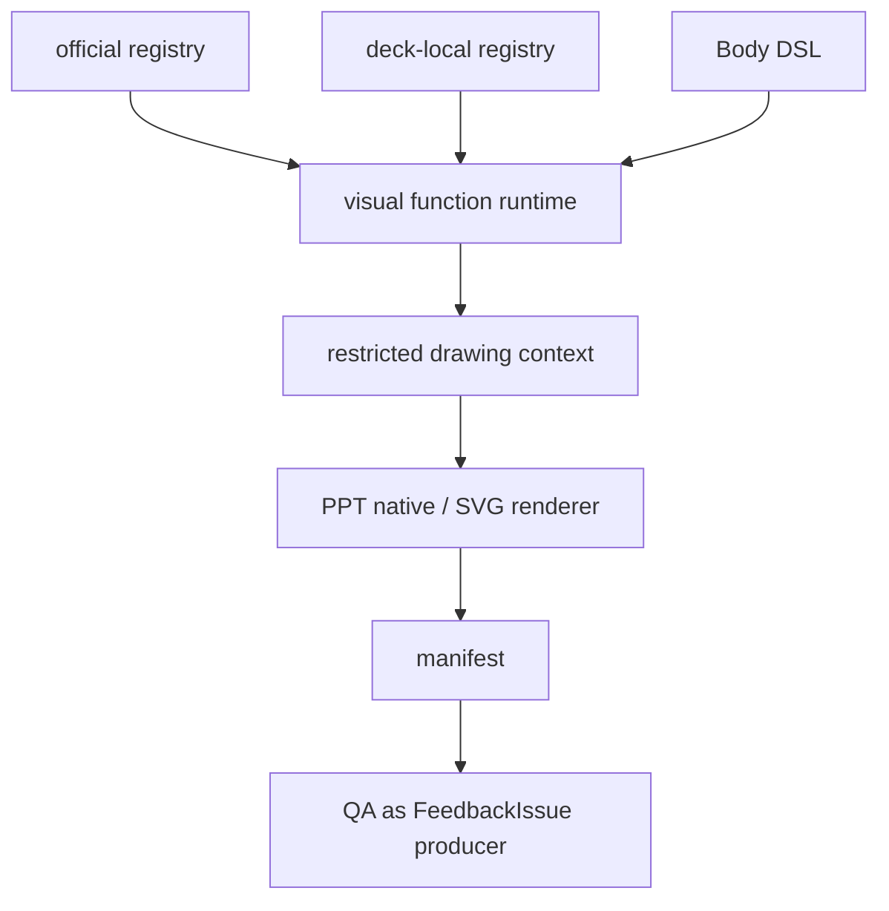

# refactor: Add Dynamic Visual Runtime and Clean Up Legacy Plan QA

## Overview

This is Step 3 of the Frame Plan + Body DSL refactor. It adds AI-dynamic deck-local visual functions and then cleans up old body plan authoring and duplicate QA implementation.

Target final flow:

```text
skeleton plan
-> frame / body slot
Body DSL
-> official registry + deck-local registry
-> normalized component tree
-> measurement/layout/render
-> manifest
-> FeedbackIssue
```

This is the cleanup step: the retired body-plan path and duplicate QA implementation details should be removed, and `generated_visual_schema.md` should be demoted from AI-facing authoring docs to renderer-facing Visual IR.

---

## Problem Frame

Step 2 makes DSL work for registered official components by bridging to the current renderer. That is not enough for an agent-native tool: humans will ask for new diagrams that no prebuilt DSL component can express. The system needs an escape hatch where agents can create deck-local draw functions dynamically while still being measured, rendered, manifested, and QA-governed.

Once that dynamic path is in place, the old plan/bodyDsl body authoring and duplicate QA rule surfaces should be cleaned up so the architecture does not carry two competing authoring models.

---

## Requirements Trace

- R1. Support deck-local AI-generated visual draw functions scoped to a deck.
- R2. Keep dynamic draw functions governed by registry validation, restricted drawing context, measurement, manifest, QA, and FeedbackIssue.
- R3. Support `Visual(role, claim, draw, model)` for official and deck-local draw ids.
- R4. Prevent dynamic functions from direct filesystem access, direct manifest writes, renderer bypasses, or unchecked image insertion.
- R5. Preserve existing editable PPT output and COM measurement quality.
- R6. Demote `generated_visual_schema.md` into renderer-facing Visual IR guidance or replace it with `visual_ir_schema.md`.
- R7. Make all QA output FeedbackIssue-compatible and remove duplicate eligibility/template checks where registry imports can replace them.
- R8. Clean up retired body-plan authoring from AI-facing runtime guidance.
- R9. Move forward tests to skeleton plan + Body DSL, including at least one deck-local dynamic visual fixture.
- R10. Run full smoke and forward tests after cleanup.

---

## Scope Boundaries

- Do not allow arbitrary Node scripts as dynamic components.
- Do not allow raw `<Image>` or unregistered visual artifacts to satisfy anchor requirements.
- Replace fixture dependencies before removing retired paths.
- Do not replace COM measurement with non-COM fallbacks.
- Do not make `SKILL.md` a component rule list; it should point to generated discovery docs.

---

## Context & Research

### Relevant Code and Patterns

- `scripts/pptx/hw_diagram_helpers.js`: existing renderer subsystem for `evidence`, `ppt_native`, and `rough_svg`.
- `references/generated_visual_schema.md`: current generated visual authoring schema, to be demoted into Visual IR.
- `scripts/pptx/contracts/visual_templates.js`: render path and template contract.
- `scripts/qa/check_huawei_pptx.js`: cleanup target for duplicate QA checks.
- `scripts/pptx/layout/measure_primitives.js`: measurement integration point.
- Step 1 FeedbackIssue foundation.
- Step 2 Body DSL registry bridge.

---

## Key Technical Decisions

- **DSL is a web-like tree, not a closed component catalog.** `Visual(draw, model)` is the dynamic escape hatch.
- **Dynamic draw functions are registered capabilities.** They must declare role, schema, output type, measurement policy, resize policy, manifest metadata, and diagnostics.
- **Deck-local functions are scoped.** They are available only for the current deck unless promoted.
- **Restricted drawing context protects the renderer.** Dynamic code draws through `ctx.text`, `ctx.rect`, `ctx.line`, `ctx.arrow`, `ctx.image`, `ctx.group`, `ctx.measureText`, `ctx.theme`, and `ctx.area`.
- **Final cleanup removes duplicate truths.** Registry becomes the source for anchor eligibility, renderer path, visibility, measurement support, and layout intent.

---

## High-Level Technical Design

> *This illustrates the intended approach and is directional guidance for review, not implementation specification. The implementing agent should treat it as context, not code to reproduce.*



Dynamic visual lifecycle:

```text
validate(model)
measure(model, slot)
render(model, slot, restricted ctx)
manifest(model, render result)
diagnose(result or error)
```

---

## Output Structure

```text
scripts/pptx/dsl/
  deck_local_registry.js
  visual_function_runtime.js
  source_map.js

references/
  visual_ir_schema.md
  generated_dsl_component_catalog.md

scripts/smoke/dsl/
  test_deck_local_visual_registry.js
  test_visual_function_runtime.js
  test_visual_ir_schema.js

scripts/qa/
  check_huawei_pptx.js
```

---

## Implementation Units

- U1. **Add Deck-Local Registry**

**Goal:** Allow a deck to register local visual draw functions that merge with the official registry at runtime.

**Requirements:** R1, R2, R3

**Dependencies:** Step 2 component registry

**Files:**
- Create: `scripts/pptx/dsl/deck_local_registry.js`
- Modify: `scripts/pptx/dsl/component_registry.js`
- Test: `scripts/smoke/dsl/test_deck_local_visual_registry.js`

**Approach:**
- Define deck-local registry file/discovery conventions.
- Merge official and deck-local registries with conflict rules.
- Require local functions to declare role, schema, output type, measure policy, resize policy, and diagnostics hooks.
- Generate deck-local discovery catalog entries for repair passes.

**Patterns to follow:**
- Step 2 registry declarations.

**Test scenarios:**
- Happy path: deck-local function registers and appears in deck-local discovery output.
- Error path: missing role/schema/render hook rejects registration.
- Error path: deck-local id cannot shadow official id unless explicitly allowed.
- Integration: `Visual(draw="custom.xxx")` resolves after registry merge.

**Verification:**
- Deck-local components are available to one deck without becoming official.

---

- U2. **Implement Visual Function Runtime**

**Goal:** Execute official and deck-local draw functions through a restricted lifecycle and drawing context.

**Requirements:** R2, R3, R4, R5

**Dependencies:** U1

**Files:**
- Create: `scripts/pptx/dsl/visual_function_runtime.js`
- Create: `scripts/pptx/dsl/source_map.js`
- Modify: `scripts/pptx/hw_visual_anchor_slide.js`
- Modify: `scripts/pptx/layout/measure_primitives.js`
- Test: `scripts/smoke/dsl/test_visual_function_runtime.js`

**Approach:**
- Provide restricted drawing APIs and prevent direct manifest writes.
- Support PPT-native and SVG/image-artifact outputs through the same manifest-backed path.
- Connect measurement and render diagnostics to FeedbackIssue with draw id and model-field context.
- Preserve COM measurement as the authority for final layout.

**Patterns to follow:**
- `scripts/pptx/hw_diagram_helpers.js` native/SVG split.
- `scripts/pptx/layout/measure_primitives.js` measurement contract.

**Test scenarios:**
- Happy path: dynamic PPT-native visual renders, measures, and writes manifest metadata.
- Happy path: dynamic SVG visual renders through governed artifact path.
- Error path: unregistered draw id fails before render.
- Error path: dynamic function cannot directly mutate manifest.
- Error path: dynamic function trying unsupported ctx operation fails with FeedbackIssue.

**Verification:**
- Dynamic visuals behave like registered official visuals from the perspective of measurement, manifest, and QA.

---

- U3. **Demote Generated Visual Schema to Visual IR**

**Goal:** Move current `generated_visual_schema.md` concepts behind DSL as renderer-facing Visual IR rather than AI-facing primary authoring docs.

**Requirements:** R6, R8

**Dependencies:** U2

**Files:**
- Create: `references/visual_ir_schema.md`
- Modify or replace: `references/generated_visual_schema.md`
- Modify: `references/generated_dsl_component_catalog.md`
- Test: `scripts/smoke/dsl/test_visual_ir_schema.js`

**Approach:**
- Document `kind/template/visual_spec` as compiler/renderer IR.
- Keep low-level `GeneratedVisual` or official `Visual` available for advanced cases, but make component catalog the AI-facing entry.
- Remove runtime wording that asks agents to hand-author raw visual spec as the default path.

**Patterns to follow:**
- `references/generated_visual_schema.md`
- `scripts/pptx/contracts/visual_templates.js`

**Test scenarios:**
- Happy path: official visual components compile to valid Visual IR.
- Happy path: `Visual(draw="sequence.process")` compiles to current `Sequence/process` IR.
- Error path: forbidden prose fields in Visual IR remain rejected.

**Verification:**
- Renderer-facing schema remains explicit while AI-facing docs point to DSL catalog.

---

- U4. **Clean Up QA Around Registry and FeedbackIssue**

**Goal:** Remove duplicated QA lists and make all QA output FeedbackIssue-compatible.

**Requirements:** R2, R7, R10

**Dependencies:** U1, U2, U3

**Files:**
- Modify: `scripts/qa/check_huawei_pptx.js`
- Modify: `scripts/pptx/contracts/visual_templates.js`
- Test: `scripts/smoke/test_feedback_issue_contract.js`
- Test: `scripts/smoke/test_visual_anchor_content_contract.js`
- Test: `scripts/smoke/layout/test_taxonomy_coverage_contract.js`

**Approach:**
- Replace duplicated eligibility/template logic with registry or visual template contract imports.
- Ensure every QA issue has FeedbackIssue-compatible phase, target, details, and optional repairs.
- Keep existing hard failures for missing real anchor, manifest mismatch, unsupported component, destructive fitting, evidence below floor, and COM/render failures.

**Patterns to follow:**
- Step 1 FeedbackIssue format.
- Current QA issue helper.

**Test scenarios:**
- Happy path: supporting components still cannot satisfy real anchors.
- Happy path: official and deck-local real anchors are counted only when manifest-backed.
- Error path: destructive evidence fitting is hard failure.
- Integration: QA report remains backward-compatible while exposing FeedbackIssue fields.

**Verification:**
- QA imports shared contracts and produces one feedback language.

---

- U5. **Migrate Runtime Workflow and Forward Tests**

**Goal:** Make skeleton plan + Body DSL the only runtime path for body authoring, including dynamic visuals.

**Requirements:** R8, R9, R10

**Dependencies:** U4

**Files:**
- Modify: `SKILL.md`
- Modify: `README.md`
- Modify: `references/slide_dsl_authoring_schema.md`
- Modify: `scripts/quality/software_test_report.js`
- Modify or add: `forward-tests/huawei-ppt-gen/*`

**Approach:**
- Teach agents to use component discovery: index, detail, catalog, FeedbackIssue.
- Teach escalation: official sugar components first, `Visual(draw, model)` for unusual visuals, deck-local draw functions when existing components cannot express the request.
- Update forward fixtures so all primary content pages use skeleton plan + Body DSL.
- Include at least one forward fixture with deck-local dynamic visual.
- Remove retired body-plan authoring docs.

**Patterns to follow:**
- Existing forward-test structure.
- Step 2 DSL fixture.

**Test scenarios:**
- Integration: all primary forward fixtures render from skeleton plan + Body DSL.
- Integration: one forward fixture uses a deck-local dynamic visual and passes QA.
- Error path: old AI-facing generated visual/body plan docs no longer appear as the recommended runtime path.

**Verification:**
- `npm run smoke` and forward tests pass after cleanup.

---

## System-Wide Impact

- **Interaction graph:** Dynamic draw functions become registry-governed render capabilities rather than raw image bypasses.
- **Error propagation:** Dynamic visual failures become FeedbackIssue with draw id and model-field context.
- **State lifecycle risks:** Deck-local registries must stay scoped to the deck and not leak into official catalog.
- **API surface cleanup:** Retired body-plan compatibility should be removed after forward migration.
- **Unchanged invariants:** Evidence through `Evidence`; supporting components not anchors; COM measurement authoritative.

---

## Success Metrics

- Deck-local visual functions can be registered, measured, rendered, manifested, and QA-checked.
- Dynamic visual fixture passes smoke and forward tests.
- `generated_visual_schema.md` is no longer the primary AI authoring surface.
- QA duplicate lists are reduced in favor of shared registry/contract imports.
- Retired body-plan authoring is removed from runtime guidance.
- Full smoke and forward tests pass.

---

## Risks & Dependencies

| Risk | Mitigation |
|------|------------|
| Dynamic functions become arbitrary code | Restrict drawing context and reject direct filesystem/manifest/renderer bypasses. |
| Raw images masquerade as anchors | Require registry role, measurement, manifest, and QA proof for all dynamic visuals. |
| Cleanup breaks old fixtures | Migrate forward fixtures before removing retired paths. |
| Registry becomes too permissive | Smoke-test official/deck-local visibility, eligibility, and destructive fitting rules. |

---

## Documentation / Operational Notes

- This step is the only step that should clean old AI-facing plan and QA implementations.
- Do not remove old paths until Step 2 DSL forward fixture has already proven equivalent output quality.

---

## Sources & References

- Step 1 plan: `docs/plans/2026-05-31-001-refactor-frame-feedback-foundation-plan.md`
- Step 2 plan: `docs/plans/2026-05-31-002-refactor-body-dsl-registry-bridge-plan.md`
- Diagram renderer: `scripts/pptx/hw_diagram_helpers.js`
- Visual schema: `references/generated_visual_schema.md`
- Hard QA: `scripts/qa/check_huawei_pptx.js`
